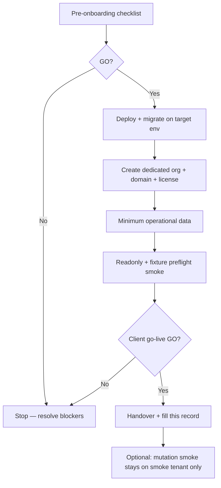

# First client onboarding record (controlled B2B)

**Status:** Active operator template — fill per real client; store secrets only in vault, not in git.  
**Batch:** `production-first-client-onboarding-record-v1`  
**Decision:** [DEC-043](./decision-log.md)  
**Cutline:** [production-readiness-cutline.md](./production-readiness-cutline.md) (**DEC-032**)  
**Smoke policy:** [production-smoke-e2e.md](../../driving_school_platform/nextjs_space/docs/ops/production-smoke-e2e.md) (**DEC-039**, **DEC-040**, **DEC-041**)

---

## Purpose

Provide a **simple, auditable, docs-only** record for opening the **first real controlled B2B client** on DAT — without building a CRM, without mixing smoke data, and without depending on operator memory.

This document is used in two modes:

1. **Pre go-live** — checklist and go/no-go gate before the client operates on production.
2. **Post go-live** — filled evidence record (IDs, dates, smoke results, handover notes) committed or stored in a private operator channel as agreed.

**Not in scope:** billing/checkout, RLS changes, auth changes, smoke cleanup/reassignment, production env var edits via this batch.

---

## Smoke tenant vs first real client

| Aspect | **A Conquistadora** (temporary smoke) | **First real client** (this record) |
| ------ | ------------------------------------- | ----------------------------------- |
| Role | Production **smoke / test** tenant on `www.meengine.io` | Dedicated **operational** school tenant |
| Fixture IDs | Fixed `DAT_SMOKE_*` IDs in smoke runbook | **New** org — **do not reuse** smoke fixture IDs |
| Mutation smoke | Opt-in `DAT_E2E_ALLOW_PRODUCTION_MUTATIONS` on smoke fixtures only | **Do not** use real client records as mutable smoke fixtures |
| This document | Reference only (smoke status section) | Primary fill target |

Smoke tenant details remain in [production-smoke-e2e.md](../../driving_school_platform/nextjs_space/docs/ops/production-smoke-e2e.md). When the real client tenant exists, automated smoke may eventually move to a **dedicated smoke org** — that is a **separate** operator decision, not part of this record.

---

## Operator workflow (high level)



---

## Section A — Pre-onboarding (before any client prod work)

| # | Check | Status | Notes / evidence |
| - | ----- | ------ | ---------------- |
| A1 | Client contract / scope agreed (invite-only B2B, no live billing) | ☐ | Align with DEC-032 |
| A2 | Target **tenant host** decided (not `demo.meengine.io`) | ☐ | e.g. `school.example.com` |
| A3 | **Dedicated organization** planned (not A Conquistadora) | ☐ | New `Organization` row |
| A4 | `PUBLIC_SIGNUP_ENABLED=false` on target production | ☐ | Env / deployment checklist |
| A5 | Credential policy: no `PLATFORM_ADMIN` / `SUPER_ADMIN` secrets in tickets or git | ☐ | Vault only |
| A6 | Postmark / email routing reviewed for client domain if needed | ☐ | [email-provider-postmark-runbook.md](../../driving_school_platform/nextjs_space/docs/ops/email-provider-postmark-runbook.md) |
| A7 | `pnpm check` green on release commit | ☐ | CI / local |
| A8 | Migration plan for target DB (`prisma migrate status` / `deploy`) | ☐ | Per-env gate |
| A9 | Smoke runbook reviewed (readonly vs mutations) | ☐ | DEC-036–041 |
| A10 | Risks / pendências logged (Section H) | ☐ | |

**Pre-onboarding GO:** A1–A4 and A8 are **mandatory**. All others strongly recommended.

---

## Section B — Deploy gate (target environment)

| # | Check | Status | Notes / evidence |
| - | ----- | ------ | ---------------- |
| B1 | `prisma migrate deploy` succeeded on **client target** DB | ☐ | Migration count / date |
| B2 | `prisma migrate status` — schema up to date | ☐ | |
| B3 | `pnpm -C driving_school_platform/nextjs_space check` green on deployed commit | ☐ | Commit SHA |
| B4 | `GET /api/health` OK on tenant host | ☐ | |
| B5 | `POST /api/signup` blocked (`public_signup_disabled` or equivalent) | ☐ | `pnpm e2e:smoke:api` or manual |
| B6 | Host guard: tenant host resolves to **client** org only | ☐ | Not platform host |

---

## Section C — Tenant / client setup

| Field | Value (fill when known) |
| ----- | ----------------------- |
| **Client / school legal name** | `<CLIENT_LEGAL_NAME>` |
| **Product display name** | `<CLIENT_DISPLAY_NAME>` |
| **Tenant host / domain** | `<client-school.example.com>` |
| **`organizationId`** | `<cuid>` |
| **`OrganizationDomain` record** | ☐ created / verified |
| **Platform host** (operator) | `platform.meengine.io` (if split-host prod) |
| **Is demo org (`isDemo`)** | Must be **false** |
| **License / entitlements** | `<plan or key reference — no secrets>` |
| **Feature modules enabled** | e.g. `LESSON_MANAGEMENT`, `VEHICLE_MANAGEMENT`, `USER_MANAGEMENT` |
| **Settings / Plan UI** | School admin sees **Plan** read-only (DEC-026); Settings not in navbar |

**Org creation:** operator path via platform onboarding — see [platform-admin-runbook.md](../../driving_school_platform/nextjs_space/docs/ops/platform-admin-runbook.md) and [production-host-split.md](../../driving_school_platform/nextjs_space/docs/ops/production-host-split.md). Record **who** performed setup and **date** in Section H.

---

## Section D — Users / school admin

| Field | Value (fill when known) |
| ----- | ----------------------- |
| **Initial owner / SUPER_ADMIN** | `<name>` — email in vault only |
| **User.id** (owner) | `<cuid>` |
| **`isApproved`** | true |
| **Invite-only policy** | Copy-link invitations; no public signup |
| **Password / credentials** | **Vault only** — never in git |
| **Email / Postmark state** | ☐ Postmark active ☐ domain verified ☐ password reset tested ☐ verification flow N/A (invite) |

Reference: [auth-email-production-readiness-checklist.md](../../driving_school_platform/nextjs_space/docs/ops/auth-email-production-readiness-checklist.md), [invitation-copy-link-smoke.md](../../driving_school_platform/nextjs_space/docs/ops/invitation-copy-link-smoke.md).

---

## Section E — Minimum operational data

### E1 — Instructors (minimum)

| Instructor | `User.id` | `Instructor.id` | License valid | Available for booking | Qualified categories |
| ---------- | --------- | --------------- | ------------- | --------------------- | -------------------- |
| 1 | `<cuid>` | `<cuid>` | ☐ | ☐ | e.g. `B` |
| 2 | `<optional>` | | | | |

- Create via **People → Instructors → Onboarding** (invite or manual per policy).
- **License number + expiry** required on INSTRUCTOR invite (DEC-038).
- **Qualified categories** via **Edit Instructor** (DEC-042) — required for category-aware booking and smoke readiness when `forBooking=true` exposes metadata.

### E2 — Vehicles (minimum)

| Vehicle | ID | Registration | Status | Active | Notes |
| ------- | -- | ------------ | ------ | ------ | ----- |
| 1 | `<int>` | `<AA-00-BB>` | `AVAILABLE` | ☐ | At least one bookable vehicle |

### E3 — Students (minimum)

| Student | `Student.id` | `schoolStudentId` | App access mode | Notes |
| ------- | ------------ | ----------------- | --------------- | ----- |
| 1 | `<cuid>` | `<YYnnn>` | `MANUAL_ONLY` or `APP_USER` | Real client data — not smoke fixture |

**Import:** optional students/practical history via People + `/admin/lessons` import UI after dry-run preview. Import apply blocked on demo org only.

### E4 — Optional seed lesson

One manual or system-created lesson is **optional** for handover demo; not required for go-live if Schedule Map booking path is validated separately.

---

## Section F — Smoke status (technical validation)

Distinguish **smoke tenant** runs from **client tenant** validation.

### F1 — Smoke tenant (`A Conquistadora` on `www.meengine.io`)

For **automated** production smoke only — not the client record.

| Suite | Command | Last run (UTC) | Result | Commit |
| ----- | ------- | -------------- | ------ | ------ |
| API + signup guard | `pnpm e2e:smoke:api` | | ☐ pass / fail | |
| Read-only UI | `pnpm e2e:smoke:readonly` | | ☐ pass / fail | |
| Combined hosted readonly | `pnpm e2e:smoke:prod` | | ☐ pass / fail | |
| Fixture preflight | `pnpm e2e:smoke:fixture-preflight` | | ☐ pass / fail | |
| Lesson mutations (opt-in) | `pnpm e2e:smoke:mutations` | | ☐ pass / skip / N/A | |

**Mutation smoke:** requires `DAT_E2E_ALLOW_PRODUCTION=true`, `DAT_SMOKE_ALLOWED_HOSTS`, and **`DAT_E2E_ALLOW_PRODUCTION_MUTATIONS=true`**. Runs only against explicit `DAT_SMOKE_*` fixtures — **never** against first-client operational IDs.

### F2 — Client tenant (manual operator smoke)

After Sections C–E are filled, run **manual** school-admin smoke on the **client host**:

| Area | Check | Status |
| ---- | ----- | ------ |
| Navbar | Dashboard, People, Lessons, Vehicles, Plan (no Settings) | ☐ |
| People | Student manual create or profile visible | ☐ |
| People | Instructor profile + qualified categories | ☐ |
| Invitations | Copy-link invite flow (student or instructor) | ☐ |
| Lessons | Schedule Map load; create or view lesson | ☐ |
| Lessons | Edit lesson persists instructor + student (DEC-033) | ☐ |
| Vehicles | Fleet list; vehicle warning display if applicable | ☐ |
| Plan | Read-only Plan & features | ☐ |

References: [smoke-test-checklist.md](../../driving_school_platform/nextjs_space/docs/ops/smoke-test-checklist.md), [production-smoke-baseline.md](../../driving_school_platform/nextjs_space/docs/ops/production-smoke-baseline.md).

**Client automated smoke:** not required in v1 unless operator adds client-specific `DAT_SMOKE_*` in a **future** dedicated smoke org batch. Default: manual checklist on client host + automated smoke on smoke tenant.

---

## Section G — Go / no-go

| Gate | Criterion | GO? |
| ---- | --------- | --- |
| G1 | Dedicated org + host live; **not** A Conquistadora | ☐ |
| G2 | `PUBLIC_SIGNUP_ENABLED=false` | ☐ |
| G3 | Deploy + migrate + `pnpm check` on release SHA | ☐ |
| G4 | Owner SUPER_ADMIN can log in and reach `/admin` | ☐ |
| G5 | Minimum instructors (licensed, qualified categories, bookable) | ☐ |
| G6 | Minimum vehicle(s) bookable | ☐ |
| G7 | Minimum student record(s) or agreed import complete | ☐ |
| G8 | Email/Postmark acceptable for auth flows client will use | ☐ |
| G9 | License/features match sold scope | ☐ |
| G10 | Manual client smoke (Section F2) pass | ☐ |
| G11 | No open **P0** risks (Section H) | ☐ |

| Field | Value |
| ----- | ----- |
| **Go/no-go meeting date** | `YYYY-MM-DD` |
| **Decision** | ☐ **GO** ☐ **NO-GO** ☐ **GO with conditions** |
| **Approved by** | `<names/roles>` |
| **Client handover date** | `YYYY-MM-DD` |

---

## Section H — Risks / pendências

| ID | Risk / pendency | Severity | Owner | Target date | Status |
| -- | --------------- | -------- | ----- | ----------- | ------ |
| R1 | | P0/P1/P2 | | | open |
| R2 | | | | | |

**Common deferred items (not blockers for DEC-032 cutline):**

- Audit log runtime (P2)
- Mobile/tablet readiness (P2)
- Billing / checkout (out of baseline)
- Demo DB separation from portfolio (P2 when client has dedicated tenant)
- Automated smoke fixtures on client org (optional future)

---

## Section I — Handover

| Item | Status | Notes |
| ---- | ------ | ----- |
| School admin login instructions delivered (vault) | ☐ | |
| Invite-only / no public signup communicated | ☐ | |
| Support / escalation contact shared | ☐ | |
| Known limitations documented (Plan read-only, no billing portal, etc.) | ☐ | |
| Operator runbook links shared internally | ☐ | |
| This record filled and filed (git private section or secure ops wiki) | ☐ | |

---

## Example template (illustrative — no real client data)

Copy the block below into a **private** operator note or a redacted commit when the real client is onboarded. Replace all `<placeholders>`.

```markdown
# Client onboarding record — EXAMPLE ONLY

- Record version: 1
- Filled by: <operator name>
- Last updated: 2026-07-01

## Identity
- Client legal name: Example Driving School Lda
- Display name: Example Driving School
- Tenant host: example-school.meengine.io
- organizationId: clxxxxxxxxxxxxxxxxxxxxxxxxx
- Smoke tenant used for automation: A Conquistadora (separate — not this org)

## Admin
- Initial SUPER_ADMIN: Example Admin (email in vault)
- User.id: clxxxxxxxxxxxxxxxxxxxxxxxxx
- Postmark: active; domain verified 2026-06-XX; password reset smoke-passed

## License
- Plan: Starter / manual entitlement reference ENT-XXXX (no secret in git)
- Modules: LESSON_MANAGEMENT, VEHICLE_MANAGEMENT, USER_MANAGEMENT

## Minimum data
| Role | Id | Notes |
|------|-----|-------|
| Instructor 1 | Instructor.id clxxx… | Categories: B; license expiry 2027-12-31 |
| Vehicle 1 | id 42 | AB-12-CD, AVAILABLE |
| Student 1 | Student.id clyyy… | schoolStudentId 26042, MANUAL_ONLY |

## Smoke
- Smoke tenant readonly: pass @ 2026-07-01 commit ad93833
- Smoke fixture preflight: pass
- Smoke mutations: run on smoke tenant only; not on Example Driving School org
- Client manual smoke: pass 2026-07-01 (People, Schedule Map, invite copy-link)

## Go/no-go
- Decision: GO
- Date: 2026-07-01
- Conditions: none

## Risks
- R1: Audit logs not in product UI — P2 accepted
```

---

## Related documents

| Document | Role |
| -------- | ---- |
| [production-readiness-cutline.md](./production-readiness-cutline.md) | What “production-ready enough” means (DEC-032) |
| [production-smoke-e2e.md](../../driving_school_platform/nextjs_space/docs/ops/production-smoke-e2e.md) | Automated smoke suites and smoke tenant fixtures |
| [release-checklist.md](../../driving_school_platform/nextjs_space/docs/ops/release-checklist.md) | Release and invite smoke links |
| [command-batteries.md](../ops/command-batteries.md) | Deploy and validation commands |
| [decision-log.md](./decision-log.md) | DEC-032, DEC-039–042, DEC-043 |
