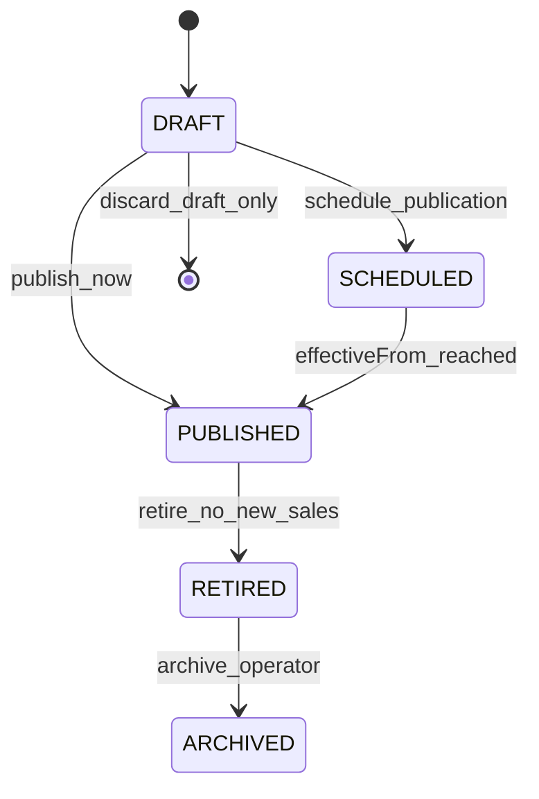

# Platform Commercial Catalogue Schema Plan

**Status:** D4 architecture plan — **IMPLEMENTED (foundation slice)** / **PARTIAL — runtime deferred**
**Batch:** `platform-commercial-catalog-schema-plan-v1` (plan); foundation implemented in `platform-commercial-catalog-schema-foundation-v1` (DEC-061)
**Baseline inspected:** main `9782199` (2026-07-14)
**Decisions (invariants):** [DEC-046](./decision-log.md)–[DEC-052](./decision-log.md), [DEC-058](./decision-log.md)–[DEC-061](./decision-log.md)
**Product intent:** [dat-plan-and-module-catalog.md](../product/dat-plan-and-module-catalog.md)

---

## 1. Executive recommendation

**Recommend Option C — Hybrid model:** stable normalized identities (`CommercialProduct`, `Plan`, `AddOn`, `EntitlementDefinition`) plus **immutable versioned commercial definitions** (`CatalogueVersion`, `PlanOffering`, `AddOnOffering`, `CataloguePrice`) scoped to published catalogue versions.

**Why (not table count):**

| Criterion | Option A (fully normalized) | Option B (JSON snapshots) | **Option C (hybrid)** |
| --------- | --------------------------- | ------------------------- | --------------------- |
| Relational integrity | Strong | Weak for grants/prices | Strong for identities + FK pinning |
| Query complexity | Higher joins | Simple reads | Moderate — indexed FK paths |
| Auditability | Good row-level | Good document-level | Best — rows + optional snapshot hash |
| Provider independence | Good | Good | Good — canonical layer separate from `ProviderCatalogueMapping` |
| Historical subscription preservation | FK to `PlanVersion` | Snapshot in subscription | **Pin `PlanOffering` + `CataloguePrice` + grant rows** |
| Plan evolution | New version rows | New JSON doc | New `CatalogueVersion` + offerings |
| Add-on support | First-class tables | Embedded in JSON | First-class `AddOn` + `AddOnOffering` |
| Entitlement computation | SQL joins | Parse JSON | SQL joins on grant tables |
| Operational complexity | Medium–high | Low publish, high debug | Medium — familiar Prisma patterns |
| Prisma ergonomics | Good | JSON validation burden | Good — enums + relations |
| Migration complexity | Medium | Low schema, high runtime | **Additive** — coexists with legacy |
| Multi-product (MeEngine) | Good | Good | **Best** — product key as data |

**Core invariants (DEC-060):**

1. Commercial catalogue is **Platform-owned**, **global**, and **provider-neutral**.
2. **Stable keys** (`DAT`, `DAT_CORE`, entitlement keys) are separate from **immutable published definitions**.
3. **Published** catalogue versions, offerings, and prices are **not silently mutated** — corrections create new versions.
4. **Historical subscriptions** pin to agreed `PlanOffering` + `CataloguePrice` (+ grant composition), never display names or live catalogue rows alone.

**Next implementation slice (not authorized here):** `platform-commercial-catalog-seed-v1` — deterministic idempotent seed definitions only; no checkout, provider, subscription lifecycle, License UI, or tenant provisioning changes.

---

## Implemented in `platform-commercial-catalog-schema-foundation-v1` (repo only — not deployed by agent)

| Area | Status |
| ---- | ------ |
| Additive enums (`CatalogueVersionStatus`, `BillingInterval`, `EntitlementValueKind`) | **Done** — `prisma/schema.prisma` |
| Stable-identity models (`CommercialProduct`, `Plan`, `AddOn`, `EntitlementDefinition`) | **Done** |
| Versioned models (`CatalogueVersion`, `PlanOffering`, `AddOnOffering`, `CataloguePrice`, grants) | **Done** |
| Relational add-on eligibility (`AddOnOfferingEligibility` + composite FKs) | **Done** — not PostgreSQL arrays |
| Product scope compound FKs on offerings/grants | **Done** — `productId` + `(id, productId)` uniqueness |
| Entitlement grants FK to `EntitlementDefinition` | **Done** |
| Typed grant value CHECK constraints (plan + add-on) | **Done** — migration SQL |
| Price `amountMinor Int`, exactly-one target, currency shape CHECK | **Done** |
| Class-B RLS + REVOKE on all 11 new tables | **Done** — migration `20260714160000_platform_commercial_catalog_schema_foundation_v1` |
| Schema contract test | **Done** — `lib/platform/commercial-catalog-schema-foundation.unit.test.ts` |
| Commercial seed data | **None** |
| Runtime catalogue services / APIs / UI | **None** |
| Operator `migrate deploy` | **Not executed** — human-controlled |

**Publication immutability:** DRAFT rows are editable at the application layer; PUBLISHED+ immutability is **not** database-enforced in this slice — future write-service boundary owns lifecycle rules.

---

## Still planned (deferred slices)

| Slice | Scope |
| ----- | ----- |
| `platform-commercial-catalog-seed-v1` | Stable identities + DRAFT catalogue shell; offerings/prices only when commercial values approved |
| `platform-commercial-catalog-read-services-v1` | Read-only catalogue repositories/APIs |
| `platform-entitlement-catalogue-bridge-v1` | Project catalogue grants → tenant `EntitlementGrant` |
| Provider mappings, subscriptions, checkout | Later D4 slices per release plan |
| Platform management UI, License self-service | Later UI slices |
| Production migration deployment | Human operator — separate from schema authoring |

---

## 2. Current implementation audit

Audit performed against live repository paths (not stale docs alone).

### 2.1 Prisma schema — commercial-adjacent models

| Model / enum | Location | What exists | Classification |
| ------------ | -------- | ----------- | -------------- |
| `Organization.subscriptionTier` | `SubscriptionTier`: `BASE`, `PREMIUM`, `ENTERPRISE` | Legacy tier enum on tenant row | **Bridge later** — maps to old `BillingPlanKey`; not DAT Core/Plus/Premium |
| `Organization.subscriptionStatus` | `ACTIVE`, `TRIAL`, `EXPIRED`, `SUSPENDED`, `CANCELLED` | Subscription lifecycle stub on org | **Bridge later** — future `TenantSubscription` owns lifecycle |
| `Organization.trialEndsAt`, `subscriptionEndsAt` | Date fields on org | Period hints | **Bridge later** |
| `OrganizationFeature` | Per-org `featureKey` + `isEnabled` | Manual/operator toggles | **Retain initially** — strongest manual override in resolver |
| `EntitlementGrant` | Time-bound grants per org | `source` string (`LICENSE_KEY`, `BILLING`, …) | **Adapt later** — tenant projection target; not catalogue |
| `LicenseKey` | One-time activation keys | Creates `EntitlementGrant` rows | **Retain initially** — operator/onboarding path; not commercial catalogue |
| `BillingEvent` | Idempotent provider event store | Migration `20260426171500` | **Retain** — event ingestion; not catalogue |
| `FeatureFlag` | Tenant/global rollout flags | Migration `20260122122339` org scope | **Do not reuse** for commercial catalogue (DEC-026) |
| `Payment` | `Decimal amount`, lesson/exam links | No `organizationId`; user/student scoped | **Do not reuse** for Platform billing or school ledger (DEC-052) |
| `SystemSetting` | Operator config | Dual-scope nullable `organizationId` | **Retain unchanged** — internal/operator |
| `ConfigurationHistory` | Change audit | Dual-scope | **Retain unchanged** |

**No models exist today for:** `CommercialProduct`, catalogue versions, plan offerings, catalogue prices, add-ons, entitlement definitions (catalogue), provider catalogue mappings, or tenant subscriptions.

### 2.2 Migrations (relevant)

| Migration | Topic |
| --------- | ----- |
| `20251111214609_init_supabase` | `organizations`, `organization_features`, `license_keys`, `subscription_tier`/`status` on org |
| `20260122122339_b2_org_scope_feature_flags` | `feature_flags.organizationId` |
| `20260426171500_billing_event_store` | `billing_events` + enums |
| `20260501151200_entitlement_grants_foundation` | `entitlement_grants` |
| `20260603120000` + v1b | Class-B RLS on tenant/platform tables |

### 2.3 Runtime — billing (`lib/billing/`)

| File | State | Notes |
| ---- | ----- | ----- |
| `types.ts` | Implemented | `BillingPlanKey` = `BASE` \| `PREMIUM` \| `ENTERPRISE` — **legacy**, not `DAT_*` |
| `billing-plans.ts` | Static map | `BILLING_PLAN_FEATURES` — **demo/provisional**; comment says projector not wired to production catalog |
| `payload-v1.ts` | Implemented | Projects plan key → feature keys via static map |
| `processor.ts` | Implemented | `applyBillingProjectionForOrganization` patches `Organization.subscription*` + `EntitlementGrant` |
| `event-store.ts` | Implemented | Idempotent `BillingEvent` persistence |
| `prisma-bridge.ts` | Implemented | `SubscriptionTier` ↔ `BillingPlanKey` |
| `providers/sibs`, `providers/skeleton` | **Stub** | `createCheckout` returns invalid URLs; no signature verification |
| `webhook-http.ts` | Partial | HTTP helpers; verification not production-grade |

**Risk:** `BillingMoney.value` is `number` (float-capable) in types — **new catalogue prices must use integer minor units**.

### 2.4 Runtime — licensing (`lib/licensing/`, `lib/services/license-service.ts`)

| Component | State |
| --------- | ----- |
| `effective-entitlements.ts` | **Production resolver** — `OrganizationFeature` (manual, non-expiring, wins) + active `EntitlementGrant` |
| `license-service.ts` | CRUD on `OrganizationFeature`; `activateLicenseKey` → grants with `source: LICENSE_KEY` |
| `lib/config/license-features.ts` | 9 `FeatureKey` values — **DAT module keys today**; category BASE/PREMIUM is marketing split, not commercial plans |

### 2.5 Platform (`lib/platform/`, `/platform`, `/api/platform/organizations`)

| Surface | State |
| ------- | ----- |
| `onboard-organization.ts` | Creates org, domains, School Admin (`SUPER_ADMIN`), optional `LicenseKey` — **does not** set commercial subscription or auto-enable features |
| `list-organizations.ts` | Read-only list for `PLATFORM_ADMIN` |
| `/platform` page | Onboard form + org list |
| `POST /api/platform/organizations` | Onboarding API |

**Gap:** No catalogue, subscription, or entitlement projection from Platform onboarding.

### 2.6 DAT License UI (`/admin/license`)

| Surface | State |
| ------- | ----- |
| `app/admin/license/page.tsx` | **Read-only** Plan & features (DEC-026 Fase C) |
| `app/api/admin/license/activate` | License key activation (legacy path) |
| `app/api/admin/license/features` | Lists enabled features |

**No checkout, no plan comparison, no interval selection.**

### 2.7 Seed data (`scripts/seed.ts`, `scripts/seed-organization.ts`)

- Default org: `DAT Production Smoke`, `subscriptionTier: BASE`, all `OrganizationFeature` disabled.
- Sample `LicenseKey` with `STUDENT_ACCESS`, `VEHICLE_MANAGEMENT`.
- **No** catalogue seed, **no** DAT Core/Plus/Premium data.

### 2.8 Naming collisions and risks

| Collision | Risk | Mitigation |
| --------- | ---- | ---------- |
| `Product` vs app "product" | Confusion in docs/code | Use **`CommercialProduct`** |
| `SubscriptionTier` BASE/PREMIUM/ENTERPRISE vs DAT_* plans | Wrong tier mapping | New catalogue keys; bridge map in migration phase |
| `FeatureFlag` vs entitlements | School admin toggles become "plans" | Catalogue `EntitlementDefinition` separate; flags remain internal |
| `Payment` vs subscription billing | Reuse assumption | DEC-052 — separate domains |
| `Organization` as customer + tenant | Tenant boundary blur | Future `CommercialCustomer` concept; link to `Organization` at provision time |
| `BillingPlanKey` in webhook payload | Provider coupling in canonical identity | Provider mapping table; payload carries offering/price IDs in future |

### 2.9 Demo-only vs production-ready

| Artifact | Demo/provisional | Production-ready |
| -------- | ---------------- | ---------------- |
| Static `billing-plans.ts` | Yes | No |
| Provider checkout stubs | Yes | No |
| Webhook without verified signatures | Yes | No |
| `EntitlementGrant` + resolver | Partial — works for manual/license/billing projection | Yes for **effective gating**; not tied to commercial catalog |
| `OrganizationFeature` manual enable | Operator path | Yes — override layer |
| `/admin/license` read-only | N/A | Yes (display only) |
| Platform onboard | Partial | Yes for **manual** tenant create; not commercial |

---

## 3. Domain boundaries

```
┌─────────────────────────────────────────────────────────────────┐
│                        PLATFORM (global)                          │
│  CommercialProduct, CatalogueVersion, Plan, PlanOffering,       │
│  CataloguePrice, EntitlementDefinition, grants, AddOn*,         │
│  ProviderCatalogueMapping, CommercialCustomer (future),         │
│  TenantSubscription (future)                                    │
└────────────────────────────┬────────────────────────────────────┘
                             │ projects grants / subscription state
                             ▼
┌─────────────────────────────────────────────────────────────────┐
│                     DAT TENANT (per Organization)               │
│  Organization, operational data, EntitlementGrant (projection), │
│  OrganizationFeature (overrides), License UI (initiate only)     │
└─────────────────────────────────────────────────────────────────┘

Separate (DAT-owned, optional):
  School ledger — student balances/charges — NOT Platform subscription
```

| Domain | Owner | Scope |
| ------ | ----- | ----- |
| Commercial catalogue | Platform | **Global** — not `organizationId` on catalogue tables |
| Entitlement definitions | Platform | Global registry per product |
| Tenant subscription state | Platform | Per commercial customer / linked org |
| Effective entitlements (runtime) | Platform writes; DAT reads | Per `organizationId` |
| School ledger | DAT | Per org — separate payment domain |
| `Organization` | DAT operational tenant | Created via Platform provisioning |

**DEC-047:** DAT License may **initiate** checkout; **never** authorize paid entitlements from redirect alone.

---

## 4. Modelling alternatives

### Option A — Fully normalized versioned catalogue

Entities: `Product`, `CatalogueVersion`, `Plan`, `PlanVersion`, `Price`, `EntitlementDefinition`, `PlanEntitlementGrant`, `AddOn`, `AddOnVersion`, `AddOnEntitlementGrant`.

**Pros:** Maximum relational integrity; precise FK pinning; SQL-friendly reporting.
**Cons:** Many tables and joins; publication workflow heavy; entitlement value typing awkward across many grant tables.

### Option B — Immutable JSON catalogue snapshots

`CatalogueVersion.snapshotJson` contains plans, prices, grants, add-ons.

**Pros:** Fast to publish; trivial versioning; easy export.
**Cons:** Weak FK for subscriptions; hard to index/query; grant validation at runtime only; Prisma JSON ergonomics; risky for partial updates.

### Option C — Hybrid (recommended)

- **Stable layer:** `CommercialProduct`, `Plan`, `AddOn`, `EntitlementDefinition` (keys never change meaning).
- **Versioned layer:** `CatalogueVersion` (lifecycle), `PlanOffering`, `AddOnOffering`, `CataloguePrice`, `PlanOfferingEntitlementGrant`, `AddOnOfferingEntitlementGrant` (immutable once catalogue published).
- **Optional:** `compositionHash` on offerings for audit/compare; future subscription snapshot references hash.

---

## 5. Recommended model (vocabulary)

| Concept | Recommended name | Rationale |
| ------- | ---------------- | --------- |
| Product | `CommercialProduct` | Avoids generic `Product` collision |
| Catalogue release | `CatalogueVersion` | Clear lifecycle (draft → published → retired) |
| Stable plan identity | `Plan` | `planKey` e.g. `DAT_CORE` |
| Versioned plan composition | `PlanOffering` | One row per (`catalogueVersionId`, `planId`) — **pin target** |
| Price | `CataloguePrice` | Linked to offering or add-on offering; not embedded in plan row |
| Entitlement registry | `EntitlementDefinition` | Stable `entitlementKey` |
| Plan grants | `PlanOfferingEntitlementGrant` | Per offering, per entitlement |
| Add-on identity | `AddOn` | Stable `addOnKey` |
| Add-on composition | `AddOnOffering` | Per catalogue version |
| Provider bridge | `ProviderCatalogueMapping` | Provider IDs **outside** canonical identity |

**Rejected for this plan:** `Plan` + `PlanVersion` alone without `CatalogueVersion` — catalogue-wide publication and multi-product scheduling need a catalogue boundary. **`Offering`** chosen over **`PlanVersion`** because the same stable `Plan` appears once per catalogue with prices and grants as siblings.

---

## 6. Candidate Prisma-style schema

> **PROPOSED — NOT IMPLEMENTED**
>
> Do not copy into `schema.prisma`. Field names are **candidates**, not approved durable decisions except where tied to DEC-058/060 invariants.

```prisma
// ─── Enums (candidate) ───────────────────────────────────────────────

enum CatalogueVersionStatus {
  DRAFT
  SCHEDULED   // optional: publishAt in future
  PUBLISHED   // active for new sales
  RETIRED     // no new sales; historical refs remain
  ARCHIVED    // operator-only visibility
}

enum BillingInterval {
  MONTHLY
  ANNUAL
}

enum EntitlementValueKind {
  BOOLEAN
  INTEGER_LIMIT
  STRING_POLICY
  JSON_CONFIG
}

enum ProviderCatalogueEntityType {
  PRODUCT
  PLAN
  ADD_ON
  PRICE
  CHECKOUT_CONFIG
}

// ─── Stable identities (global, Platform) ───────────────────────────

model CommercialProduct {
  id          String   @id @default(cuid())
  productKey  String   @unique // e.g. "DAT"
  displayName String
  description String?
  isActive    Boolean  @default(true)
  createdAt   DateTime @default(now())
  updatedAt   DateTime @updatedAt

  plans              Plan[]
  addOns             AddOn[]
  entitlementDefs    EntitlementDefinition[]
  catalogueVersions  CatalogueVersion[]

  @@map("commercial_products")
}

model Plan {
  id          String   @id @default(cuid())
  productId   String
  planKey     String   // e.g. DAT_CORE — unique per product
  displayName String   // e.g. "DAT Core" — mutable on stable Plan? See §9
  description String?
  sortOrder   Int      @default(0)
  isActive    Boolean  @default(true) // soft-retire stable plan identity
  createdAt   DateTime @default(now())
  updatedAt   DateTime @updatedAt

  product   CommercialProduct @relation(fields: [productId], references: [id])
  offerings PlanOffering[]

  @@unique([productId, planKey])
  @@index([productId])
  @@map("commercial_plans")
}

model AddOn {
  id          String   @id @default(cuid())
  productId   String
  addOnKey    String   // e.g. SCHOOL_LEDGER
  displayName String
  description String?
  isActive    Boolean  @default(true)
  createdAt   DateTime @default(now())
  updatedAt   DateTime @updatedAt

  product   CommercialProduct @relation(fields: [productId], references: [id])
  offerings AddOnOffering[]

  @@unique([productId, addOnKey])
  @@index([productId])
  @@map("commercial_add_ons")
}

model EntitlementDefinition {
  id              String   @id @default(cuid())
  productId       String
  entitlementKey  String   // e.g. LESSON_MANAGEMENT
  displayName     String
  description     String?
  defaultValueKind EntitlementValueKind @default(BOOLEAN)
  isActive        Boolean  @default(true)
  createdAt       DateTime @default(now())
  updatedAt       DateTime @updatedAt

  product CommercialProduct @relation(fields: [productId], references: [id])

  @@unique([productId, entitlementKey])
  @@index([productId])
  @@map("entitlement_definitions")
}

// ─── Versioned catalogue (immutable when published) ───────────────────

model CatalogueVersion {
  id          String   @id @default(cuid())
  productId   String
  versionKey  String   // e.g. "2026-07-01" or "dat-v1-catalogue-1"
  status      CatalogueVersionStatus @default(DRAFT)
  displayName String?
  notes       String?

  effectiveFrom DateTime?  // when published catalogue becomes sellable
  effectiveTo   DateTime?  // optional end for grandfathering windows
  publishedAt   DateTime?
  retiredAt     DateTime?

  createdAt DateTime @default(now())
  updatedAt DateTime @updatedAt

  product        CommercialProduct @relation(fields: [productId], references: [id])
  planOfferings  PlanOffering[]
  addOnOfferings AddOnOffering[]

  @@unique([productId, versionKey])
  @@index([productId, status])
  @@index([productId, effectiveFrom])
  @@map("catalogue_versions")
}

model PlanOffering {
  id                 String   @id @default(cuid())
  catalogueVersionId String
  planId             String

  // Commercial copy for this catalogue (display can differ from Plan.displayName)
  displayName     String
  description     String?
  compositionHash String?  // optional SHA-256 of grants JSON for audit

  createdAt DateTime @default(now())
  // No updatedAt after publish — immutability enforced in service layer

  catalogueVersion CatalogueVersion @relation(fields: [catalogueVersionId], references: [id])
  plan             Plan             @relation(fields: [planId], references: [id])
  prices           CataloguePrice[]
  entitlementGrants PlanOfferingEntitlementGrant[]

  @@unique([catalogueVersionId, planId])
  @@index([catalogueVersionId])
  @@index([planId])
  @@map("plan_offerings")
}

model AddOnOffering {
  id                 String   @id @default(cuid())
  catalogueVersionId String
  addOnId            String

  displayName     String
  description     String?
  // Eligibility: which plan offerings may attach this add-on
  eligiblePlanOfferingIds String[] // PostgreSQL text[] — or join table if preferred

  catalogueVersion CatalogueVersion @relation(fields: [catalogueVersionId], references: [id])
  addOn            AddOn            @relation(fields: [addOnId], references: [id])
  prices           CataloguePrice[]
  entitlementGrants AddOnOfferingEntitlementGrant[]

  @@unique([catalogueVersionId, addOnId])
  @@index([catalogueVersionId])
  @@map("add_on_offerings")
}

model CataloguePrice {
  id        String   @id @default(cuid())
  currency  String   // ISO 4217, e.g. EUR
  interval  BillingInterval
  amountMinor Int    // integer minor units — NO float/Decimal for canonical price

  // Tax posture — open decision (OD-003)
  taxTreatment String? // e.g. EXCLUSIVE | INCLUSIVE | UNKNOWN

  effectiveFrom DateTime?
  effectiveTo   DateTime?

  planOfferingId   String?
  addOnOfferingId  String?

  planOffering  PlanOffering?  @relation(fields: [planOfferingId], references: [id])
  addOnOffering AddOnOffering? @relation(fields: [addOnOfferingId], references: [id])

  createdAt DateTime @default(now())

  @@index([planOfferingId, interval])
  @@index([addOnOfferingId, interval])
  // Uniqueness: one active price per offering+interval+currency per catalogue (enforce in app or partial unique index)
  @@map("catalogue_prices")
}

model PlanOfferingEntitlementGrant {
  id               String @id @default(cuid())
  planOfferingId   String
  entitlementKey   String // denormalized for historical read — FK to definition at catalogue time
  valueKind        EntitlementValueKind
  valueBoolean     Boolean?
  valueInteger     Int?
  valueString      String?
  valueJson        Json?

  planOffering PlanOffering @relation(fields: [planOfferingId], references: [id], onDelete: Cascade)

  @@unique([planOfferingId, entitlementKey])
  @@index([planOfferingId])
  @@map("plan_offering_entitlement_grants")
}

model AddOnOfferingEntitlementGrant {
  id              String @id @default(cuid())
  addOnOfferingId String
  entitlementKey  String
  valueKind       EntitlementValueKind
  valueBoolean    Boolean?
  valueInteger    Int?
  valueString     String?
  valueJson       Json?

  addOnOffering AddOnOffering @relation(fields: [addOnOfferingId], references: [id], onDelete: Cascade)

  @@unique([addOnOfferingId, entitlementKey])
  @@map("add_on_offering_entitlement_grants")
}

// ─── Provider mapping (future slice — not implemented) ────────────────

model ProviderCatalogueMapping {
  id           String   @id @default(cuid())
  provider     BillingProvider // reuse existing enum or string union
  entityType   ProviderCatalogueEntityType
  canonicalId  String   // cuid of PlanOffering, CataloguePrice, etc.
  providerRef  String   // Stripe price id, SIBS product code, etc.
  metadata     Json?
  isActive     Boolean  @default(true)
  createdAt    DateTime @default(now())
  updatedAt    DateTime @updatedAt

  @@unique([provider, entityType, canonicalId])
  @@index([provider, providerRef])
  @@map("provider_catalogue_mappings")
}

// ─── Future subscription domain (reference only — OUT OF SCOPE) ───────

// model TenantSubscription { ... }
// model SubscriptionItem {
//   planOfferingId   String  // REQUIRED pin
//   cataloguePriceId String  // REQUIRED pin
//   addOnOfferingId  String? // for add-on line items
//   entitlementSnapshotHash String? // optional denormalized audit
// }
```

---

## 7. Table-by-table D4 analysis

### `CommercialProduct`

| Area | Analysis |
| ---- | -------- |
| Domain responsibility | Root of commercial catalogue for one MeEngine product (`DAT`, future products) |
| Stable identity | `productKey` (e.g. `DAT`) — never reused for a different product |
| Versioned data | Display name, description |
| Mutability | Draft edits on product metadata OK; not tied to published catalogue |
| Tenant scope | **Global Platform** |
| Historical retention | Product row retained; `isActive=false` stops new catalogues |
| Indexes | `@@unique([productKey])` |
| Security | `PLATFORM_ADMIN` write; School Admin read-only via DAT License (product name only) |
| Provider coupling | None |
| Migration impact | Additive seed: one `DAT` row |

### `Plan`

| Area | Analysis |
| ---- | -------- |
| Domain responsibility | Stable commercial plan identity (`DAT_CORE`, `DAT_PLUS`, `DAT_PREMIUM`) |
| Stable identity | `planKey` per product |
| Versioned data | Per-catalogue display/description on `PlanOffering` |
| Mutability | `Plan.displayName` may update for **marketing**; subscriptions pin `PlanOffering`, not `Plan.displayName` |
| Tenant scope | Global |
| Historical retention | Plan row never deleted; `isActive=false` blocks new offerings only |
| Indexes | `@@unique([productId, planKey])` |
| Security | Platform Admin |
| Provider coupling | None |
| Migration impact | Seed three plan rows for DAT |

### `CatalogueVersion`

| Area | Analysis |
| ---- | -------- |
| Domain responsibility | Bounded snapshot of commercial definitions for a product |
| Stable identity | `versionKey` per product |
| Versioned data | Entire offerings set |
| Mutability | **DRAFT:** editable; **PUBLISHED+:** immutable (service-enforced) |
| Tenant scope | Global |
| Historical retention | All versions retained for audit and pinned subscriptions |
| Indexes | `(productId, status)`, `(productId, effectiveFrom)` |
| Security | Platform Admin publish; School Admin no direct access |
| Provider coupling | None on canonical row |
| Migration impact | Seed one DRAFT catalogue |

### `PlanOffering`

| Area | Analysis |
| ---- | -------- |
| Domain responsibility | Plan composition within one catalogue version |
| Stable identity | `id` (cuid) — **subscription pin target** |
| Versioned data | Grants, prices, catalogue-specific copy |
| Mutability | Immutable after catalogue publish |
| Tenant scope | Global |
| Historical retention | Permanent |
| Indexes | `@@unique([catalogueVersionId, planId])` |
| Security | Platform Admin |
| Provider coupling | Mapped via `ProviderCatalogueMapping` |
| Migration impact | Seed offerings when grants/prices seeded |

### `CataloguePrice`

| Area | Analysis |
| ---- | -------- |
| Domain responsibility | Canonical money for plan or add-on in one catalogue |
| Stable identity | `id` — subscription pin target |
| Versioned data | N/A — row is the price fact |
| Mutability | Immutable after publish |
| Tenant scope | Global |
| Historical retention | Permanent |
| Indexes | Per offering + interval |
| Security | Platform Admin; School Admin sees amounts on License UI (future) |
| Provider coupling | **Separate** mapping table |
| Migration impact | Placeholder amounts or null until pricing decided |

### `EntitlementDefinition`

| Area | Analysis |
| ---- | -------- |
| Domain responsibility | Registry of entitlement keys per product |
| Stable identity | `entitlementKey` |
| Versioned data | Display metadata |
| Mutability | Definitions evolve; grants on offerings are immutable per catalogue |
| Tenant scope | Global |
| Historical retention | Permanent |
| Indexes | `@@unique([productId, entitlementKey])` |
| Security | Platform Admin |
| Provider coupling | None |
| Migration impact | Seed keys aligned with `lib/config/license-features.ts` + future modules (`SCHOOL_LEDGER`, `EMAIL_REMINDERS`, …) |

### `PlanOfferingEntitlementGrant` / `AddOnOfferingEntitlementGrant`

| Area | Analysis |
| ---- | -------- |
| Domain responsibility | Composition of entitlements for an offering |
| Stable identity | (`offeringId`, `entitlementKey`) |
| Versioned data | Value columns / JSON |
| Mutability | Immutable after catalogue publish |
| Tenant scope | Global |
| Historical retention | Permanent — explains what customer bought |
| Indexes | Unique per offering + key |
| Security | Platform Admin |
| Provider coupling | None |
| Migration impact | Populated when package matrix approved — **provisional in seed** |

### `AddOn` / `AddOnOffering`

| Area | Analysis |
| ---- | -------- |
| Domain responsibility | First-class commercial add-ons (e.g. school ledger) |
| Stable identity | `addOnKey` |
| Versioned data | Offering-level eligibility, prices, grants |
| Mutability | Same draft/publish rules as plans |
| Tenant scope | Global |
| Historical retention | Permanent |
| Indexes | Unique per catalogue + add-on |
| Security | Platform Admin |
| Provider coupling | Mapping on price/offering |
| Migration impact | Optional seed rows — OD-007 open |

### `ProviderCatalogueMapping`

| Area | Analysis |
| ---- | -------- |
| Domain responsibility | Bridge canonical ↔ PSP |
| Stable identity | (`provider`, `entityType`, `canonicalId`) |
| Versioned data | `providerRef`, metadata |
| Mutability | New mapping rows on provider change; old retained |
| Tenant scope | Global |
| Historical retention | Permanent for reconciliation |
| Indexes | Unique canonical; lookup by provider ref |
| Security | Platform Admin / ops only |
| Provider coupling | **This is the coupling layer** |
| Migration impact | Empty until checkout slice |

---

## 8. Keys and naming conventions

| Key type | Pattern | Examples | Rules |
| -------- | ------- | -------- | ----- |
| Product key | `SCREAMING_SNAKE` short code | `DAT` | Globally unique; not display name |
| Plan key | `{PRODUCT}_{TIER}` | `DAT_CORE`, `DAT_PLUS`, `DAT_PREMIUM` | DEC-058; stable across catalogues |
| Add-on key | `SCREAMING_SNAKE` module | `SCHOOL_LEDGER`, `EMAIL_REMINDERS` | Product-scoped |
| Entitlement key | `SCREAMING_SNAKE` | `LESSON_MANAGEMENT`, `IMPORT_EXPORT` | Align with runtime `FeatureKey` where same capability |
| Catalogue version key | Product-prefixed slug | `dat-catalogue-2026-07-01` | Unique per product |
| Billing interval | Enum | `MONTHLY`, `ANNUAL` | DEC-049; separate from plan key |
| Currency | ISO 4217 | `EUR` | Open default for PT market |

**Never use as FK:** display names, provider price IDs, browser query params, `SubscriptionTier` enum values for new commercial logic.

---

## 9. Catalogue lifecycle



| Rule | Recommendation |
| ---- | -------------- |
| Multiple active catalogues | **At most one `PUBLISHED` catalogue per product** for default new sales; `SCHEDULED` allowed for future `effectiveFrom` |
| Grandfathering | Existing subscriptions keep pinned `PlanOffering`; new sales use current `PUBLISHED` |
| Rollback | **Publish new catalogue version** — do not mutate published rows |
| Edit after publish | **Forbidden** for offerings, prices, grants; clone to new DRAFT catalogue |
| Corrections | New catalogue version + optional operator communication; no silent customer migration |
| Scheduled publication | `SCHEDULED` + `effectiveFrom`; job promotes to `PUBLISHED` (future ops slice) |

---

## 10. Price model

| Requirement | Recommendation |
| ----------- | -------------- |
| Storage | `amountMinor Int` — **no floating point** |
| Currency | `String` ISO 4217 (`EUR` default — open) |
| Intervals | **Independent** `MONTHLY` and `ANNUAL` rows per offering — annual **not** derived as monthly × 12 |
| Effective dates | `effectiveFrom` / `effectiveTo` on price row within catalogue context |
| Immutability | Published prices immutable; new catalogue for changes |
| Uniqueness | One price per (`planOfferingId` or `addOnOfferingId`, `interval`, `currency`) per catalogue |
| Provider mapping | `ProviderCatalogueMapping` entityType `PRICE` |
| Tax | **Open** — `taxTreatment` placeholder; OD-003 VAT inclusive vs exclusive |

**Prisma note:** Legacy `Payment.amount` uses `Decimal` — **do not extend** that pattern to catalogue. `BigInt` deferred unless amounts exceed `Int` range (~€21M in cents); `Int` sufficient for DAT v1.

**Repository evidence:** `lib/billing/types.ts` uses `number` for `BillingMoney.value` — catalogue layer should **not** copy this; migrate billing types when checkout slice integrates.

---

## 11. Entitlement model

### Definition registry

- `EntitlementDefinition` per product — stable keys.
- **Not** `FeatureFlag` or raw `OrganizationFeature` rows.

### Value representation (recommended: constrained hybrid)

| `EntitlementValueKind` | Storage | Validation |
| ---------------------- | ------- | ---------- |
| `BOOLEAN` | `valueBoolean` | Required when kind=BOOLEAN |
| `INTEGER_LIMIT` | `valueInteger` | >= 0 or sentinel for unlimited (open) |
| `STRING_POLICY` | `valueString` | Enum registry in app layer (future) |
| `JSON_CONFIG` | `valueJson` | Schema per entitlement key in service validation |

**Rejected for v1 catalogue:** fully typed column per entitlement (combinatorial explosion). **Rejected:** JSON-only without `valueKind` (weak queries).

### Runtime projection

Catalogue grants → future subscription projector → `EntitlementGrant` rows on `organizationId` with `source: BILLING` (existing table). Manual `OrganizationFeature` remains override layer (DEC-026).

### Mapping to current `FeatureKey`

Existing keys in `lib/config/license-features.ts` are **compatibility layer**. New commercial keys (e.g. `SCHOOL_LEDGER`, `EMAIL_REMINDERS`, `IMPORT_EXPORT_SELF_SERVICE`) may extend registry — **package matrix remains provisional**.

---

## 12. Add-on model

| Requirement | Design |
| ----------- | ------ |
| First-class identity | `AddOn` + `AddOnOffering` per catalogue |
| Prices | Optional monthly/annual `CataloguePrice` on `addOnOfferingId` |
| Grants | `AddOnOfferingEntitlementGrant` |
| Eligibility | `eligiblePlanOfferingIds` on offering (or join table) — e.g. ledger on Core+ as add-on, on Premium bundled |
| Bundled + standalone | Same `AddOn` can appear in plan grants **and** separate add-on offering (OD-007) |
| Retirement | Retire add-on offering in new catalogue; pinned subscription items keep historical offering |

**School ledger (OD-007):** Not closed — model supports included-in-Premium, sold-as-add-on, or both.

---

## 13. Historical subscription pinning

**Minimum safe boundary (recommended):**

| Pin field | Required? | Purpose |
| --------- | --------- | ------- |
| `planOfferingId` | **Yes** | Exact plan composition version |
| `cataloguePriceId` | **Yes** | Agreed interval and amount |
| `catalogueVersionId` | Denormalized optional | Audit/debug |
| `addOnOfferingId` + price | Per add-on line | Add-on agreements |
| Entitlement snapshot hash | Optional | Fast audit without joins |

**Rejected pin strategies:**

| Strategy | Why insufficient |
| -------- | ---------------- |
| Stable plan only (`DAT_PREMIUM`) | Loses composition/price at purchase time |
| Display name | Not stable |
| Live catalogue row | Silent mutation breaks agreement |
| Provider price ID only | Provider change breaks history |

**Future `SubscriptionItem` (not designed here):** references `planOfferingId`, `cataloguePriceId`; projector writes `EntitlementGrant` from **pinned** grant rows, not current published catalogue.

---

## 14. Provider mapping boundary

```
Canonical layer                    Provider layer
─────────────────                  ────────────────
CommercialProduct.productKey  ←→   Provider product id
PlanOffering.id               ←→   Provider plan/price bundle
CataloguePrice.id             ←→   Provider price id
AddOnOffering.id              ←→   Provider add-on id
(checkout config id)          ←→   Provider checkout session template
```

| Rule | Detail |
| ---- | ------ |
| Canonical validity | Catalogue usable with **zero** provider mappings (manual/on-prem sales) |
| Provider change | New mapping rows; canonical IDs unchanged |
| Webhook reconciliation | Map provider ref → `canonicalId` → subscription projector |
| No provider IDs in | `planKey`, `productKey`, `CataloguePrice.amountMinor` identity |

Existing `BillingEvent` store **retains** provider events; future processor resolves via `ProviderCatalogueMapping`.

---

## 15. Multi-product design

| Principle | Implementation |
| --------- | -------------- |
| No DAT-specific columns | All DAT concepts are **seed data** under `productKey=DAT` |
| Future product | New `CommercialProduct` row + own catalogue — **no schema migration** |
| Shared enums | `BillingInterval`, `EntitlementValueKind` — product-neutral |
| Cross-product entitlements | Keys namespaced by product (`entitlementKey` unique per `productId`) |
| Platform Admin UI (future) | Product switcher — not in v1 foundation slice |

---

## 16. Existing-model coexistence

| Current artifact | Classification | Coexistence strategy |
| ---------------- | -------------- | -------------------- |
| `Organization.subscriptionTier/Status` | Bridge later | Keep; map from subscription projector during transition |
| `OrganizationFeature` | Retain | Manual override; strongest in resolver |
| `EntitlementGrant` | Adapt later | Continue as **tenant projection**; add catalogue-driven sources |
| `LicenseKey` | Retain initially | Operator/onboarding; parallel to commercial until deprecated |
| `billing-plans.ts` static map | Deprecate later | Bridge: map `DAT_*` → legacy keys until projector reads catalogue |
| `BillingEvent` + processor | Retain | Extend payload to carry `planOfferingId`/`cataloguePriceId` (future) |
| `FeatureFlag` | Do not reuse | Internal only; not catalogue |
| `Payment` | Do not reuse | School ledger builds separate model (future) |
| `lib/config/license-features.ts` | Bridge temporarily | Map entitlement keys to `FeatureKey` for gating |
| Platform onboard | Adapt later | Phase 6+ link subscription on provision |
| `/admin/license` read-only | Retain | Self-service UI later reads catalogue via API |

**No big-bang:** catalogue tables additive; resolver unchanged until bridge slice.

---

## 17. Migration phases

| Phase | Data | Runtime | Rollback | Validation | Prod risk | Separate slice? |
| ----- | ---- | ------- | -------- | ---------- | --------- | --------------- |
| **1** Catalogue foundation tables/enums | Additive migration | None | Drop tables if empty pre-prod | `prisma migrate`; schema tests | Low if unused | **`platform-commercial-catalog-schema-foundation-v1`** |
| **2** Seed DAT product + DRAFT catalogue | Seed script | None | Delete seed rows | Counts + unique keys | Low | `platform-commercial-catalog-seed-v1` |
| **3** Seed DAT_CORE/PLUS/PREMIUM identities | Seed | None | Revert seed | Key grep | Low | Same or follow-on seed |
| **4** Prices + entitlement grants (provisional) | Seed | None | Revert seed | FK integrity | Low — draft only | `platform-commercial-catalog-content-seed-v1` |
| **5** Read-only catalogue services | None | `lib/platform/catalogue/*` read APIs | Remove services | Unit tests | Low | `platform-commercial-catalog-read-services-v1` |
| **6** Bridge License/resolver | None | Projector reads catalogue | Feature flag off | Integration tests | **Medium** | `platform-entitlement-catalogue-bridge-v1` |
| **7** Tenant subscription domain | New tables | Subscription CRUD | Additive rollback | D4 gate | **High** | `platform-tenant-subscription-schema-v1` |
| **8** Provider mappings + checkout | Mapping rows | Checkout/webhook | Disable provider | Staging e2e | **High** | `platform-subscription-checkout-foundation-v1` |
| **9** Retire legacy plan/demo constructs | Data migration | Remove static map | Keep bridge read-only | Smoke | Medium | `platform-billing-legacy-retire-v1` |
| **10** Remove bridges | Cleanup | Code delete | Restore bridge flag | Full `pnpm check` | Medium | After evidence only |

**No migration generated in this planning batch.**

---

## 18. Security and access boundaries

| Surface | Platform Admin | School Admin | Student/Instructor |
| ------- | -------------- | ------------ | ------------------ |
| Catalogue CRUD/publish | Yes | No | No |
| Catalogue read (list plans/prices) | Yes | Future: License UI read-only | No |
| Provider mappings | Yes | No | No |
| `OrganizationFeature` override | Yes (ops) | No | No |
| Effective entitlements | Via projection | Read via License/hooks | Feature gates only |
| `FeatureFlag` admin | Ops/internal | Hidden (DEC-026) | N/A |

**RLS:** New catalogue tables are **Platform-global** — recommend Class-B pattern (RLS + REVOKE) like `billing_events`; app access via `PLATFORM_ADMIN` only until tenant-scoped subscription tables arrive.

**Tenant boundary:** Catalogue tables have **no** `organizationId`. Subscription tables (future) link `commercialCustomerId` ↔ `organizationId` at provision time (DEC-053).

---

## 19. Risks and mitigations

| Risk | Severity | Mitigation |
| ---- | -------- | ---------- |
| Legacy `SubscriptionTier` confusion | P1 | Explicit bridge map; document in processor; never write DAT_* into tier enum |
| Float money in billing types | P1 | Catalogue uses `Int`; fix `BillingMoney` in checkout slice |
| `OrganizationFeature` bypasses catalogue | P2 | Document override precedence; audit manual enables |
| Published catalogue mutation | P1 | Service-layer immutability + DB triggers optional |
| Pinning omitted in subscription design | P0 | DEC-060; foundation slice docs subscription FKs |
| `FeatureFlag` mistaken for entitlements | P1 | DEC-026; separate tables and docs |
| `Payment` reuse pressure | P1 | DEC-052 explicit in coexistence |
| Multi-product schema creep | P2 | Product key discipline; review checklist per new product |
| Prisma migration on production | P2 | Additive only; foundation slice gated |

---

## 20. Open decisions

| ID | Topic | Status |
| -- | ----- | ------ |
| OD-001 | Billing provider (SIBS / Stripe / other) | Open |
| OD-002 | Final prices | Open |
| OD-003 | VAT/tax handling; tax-inclusive vs exclusive display | Open |
| OD-004 | Proration on upgrade/downgrade | Open |
| OD-005 | Trial duration and conversion | Open |
| OD-006 | Grace period after payment failure | Open |
| OD-007 | School ledger: Premium included vs add-on vs both | Open |
| OD-008 | Email reminders: Core vs Plus vs add-on | Open |
| OD-009 | Annual discount policy (independent annual price vs discount %) | Open |
| OD-010 | Upgrade/downgrade/cancellation timing | Open |
| OD-011 | Usage limits (users, students, storage) | Open |
| OD-012 | Entitlement value representation edge cases (unlimited sentinel) | Open |
| OD-013 | Catalogue publication workflow (UI vs script) | Open |
| OD-014 | Grandfathering policy when catalogue retires | Open |
| OD-015 | `eligiblePlanOfferingIds` as array vs join table | **Closed (DEC-061)** — relational `AddOnOfferingEligibility` join model with composite FKs |
| OD-016 | `Plan.displayName` mutability vs offering-only copy | Open — leaning offering-only for published copy |

**Do not fabricate commercial answers in implementation without product approval.**

---

## 21. Ordered implementation slices

| Order | Slice | Type | Gate |
| ----- | ----- | ---- | ---- |
| 1 | `platform-commercial-catalog-schema-plan-v1` | Docs | **Done (this document)** |
| 2 | `platform-commercial-catalog-schema-foundation-v1` | Schema/migration | **Done (repo)** — migration `20260714160000_platform_commercial_catalog_schema_foundation_v1`; not deployed by agent |
| 3 | `platform-commercial-catalog-seed-v1` | Seed | **Recommended next** — sensitive data; approval required |
| 4 | `platform-commercial-catalog-read-services-v1` | Runtime read | Approval |
| 5 | `platform-entitlement-catalogue-bridge-v1` | Runtime bridge | D4 — billing adjacent |
| 6 | `platform-tenant-subscription-schema-v1` | Schema | D4 |
| 7 | `platform-subscription-checkout-foundation-v1` | Runtime + provider | D4 |
| 8 | `dat-license-self-service-ui-v1` | UI | DEC-047 |
| 9 | `platform-billing-legacy-retire-v1` | Cleanup | Evidence required |

Aligns with [dat-v1-commercial-release-plan.md](./dat-v1-commercial-release-plan.md) and [platform-subscription-billing-entitlements-plan.md](./platform-subscription-billing-entitlements-plan.md).

---

## 22. Explicit non-goals (this plan and foundation slice)

- No changes to `prisma/schema.prisma` in this batch
- No checkout, webhooks, or PSP integration
- No subscription lifecycle implementation
- No DAT License UI changes
- No tenant provisioning changes
- No final package matrix or prices
- No school ledger schema
- No retirement of `LicenseKey` / `billing-plans.ts`
- No `FeatureFlag` → catalogue migration
- No production operator actions

---

## Related documents

| Document | Role |
| -------- | ---- |
| [dat-plan-and-module-catalog.md](../product/dat-plan-and-module-catalog.md) | Product plan/module intent (provisional matrix) |
| [platform-subscription-billing-entitlements-plan.md](./platform-subscription-billing-entitlements-plan.md) | Billing + projection flow |
| [platform-multi-product-control-plane-plan.md](./platform-multi-product-control-plane-plan.md) | Control plane extraction |
| [dat-v1-commercial-release-plan.md](./dat-v1-commercial-release-plan.md) | Release sequencing |
| [packaging-and-entitlements.md](../product/packaging-and-entitlements.md) | Enforcement backlog |

---

*End of plan — foundation schema implemented in repo (DEC-061); not deployed; no catalogue data.*
