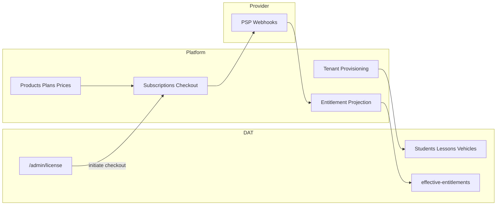

# Platform Multi-Product Control Plane Plan

**Status:** Architecture plan (docs-only). **Not** implementation authorization.
**Batch:** `dat-v1-commercial-platform-cutline-plan-v1`
**Decisions:** [DEC-053](../architecture/decision-log.md), [DEC-054](../architecture/decision-log.md)

**Supersedes (planning):** [PA-004](../product/product-assumptions.md) — Platform is no longer “vague future only”; partial runtime exists. Extraction to separate deployable product remains **phased**.

---

## Target vision

Platform evolves into a **reusable MeEngine multi-product control plane**:

| Property | Target |
| -------- | ------ |
| Product-neutral | Serves DAT today; future products without DAT-specific coupling |
| Separately deployable | Own host/deployment lifecycle (long-term) |
| Authoritative | Customers, products, subscriptions, entitlements, provisioning |
| Isolated data | Product operational data (students, lessons) stays in product apps |

**Not in v1.0:** big-bang rewrite or immediate repo split.

---

## Current implementation (facts, 2026-07-14)

| Surface | Status |
| ------- | ------ |
| `/platform` page | **Exists** — `PLATFORM_ADMIN` dashboard: onboard org form + org list |
| `GET/POST /api/platform/organizations` | **Exists** — list + onboard (org, domains, school admin, license key) |
| `platform.meengine.io` | Host for Platform admin sign-in |
| Platform admin script | `scripts/create-platform-admin.ts` |
| Post-onboard management | **Missing** — no edit/suspend/billing/subscription UI |
| Separate Platform repo/deploy | **Not yet** — same Next.js app as DAT |

**Reconcile stale docs:** References claiming “Platform has no UI/API” are **incorrect**. References claiming “Platform is production-ready commercial control plane” are also **incorrect**.

---

## Phased extraction strategy

### Phase 0 — Current (monolith boundary in code)

- Platform routes under `/platform` and `/api/platform/*`
- Shared Prisma DB with Class-B RLS on platform tables
- `PLATFORM_ADMIN` role; access policy in `lib/platform/access-policy.ts`
- DAT consumes entitlements via existing resolver

### Phase 1 — Logical product boundary (in-repo)

- Expand Platform API surface: customers, subscriptions, catalog (read/write)
- DAT License UI calls Platform APIs (server-side) instead of direct license-key hacks
- Clear module boundaries: `lib/platform/*`, `lib/billing/*` as Platform domain
- Document API contracts between “Platform domain” and “DAT domain”

### Phase 2 — Provisioning authority

- **All real tenant creation** for paying customers flows through Platform
- Onboard creates subscription + initial entitlements (not orphan license keys)
- **A Conquistadora** first client uses this path — fresh IDs, no smoke reuse

### Phase 3 — Deployable split (future)

- Separate deployment unit for Platform (host, env, scaling)
- Shared or federated identity for `PLATFORM_ADMIN`
- Event bus or webhook from Platform → DAT for entitlement sync (if DB no longer shared)
- Migration runbooks for operator — **exceptional baseline tags** if needed

---

## Platform authoritative responsibilities

| Responsibility | Notes |
| -------------- | ----- |
| Commercial customer record | Organization as DAT customer |
| Product catalog | DAT product + future products |
| Subscription lifecycle | See [platform-subscription-billing-entitlements-plan.md](./platform-subscription-billing-entitlements-plan.md) |
| Real tenant provisioning | Org, domain, initial School Admin, subscription linkage |
| Entitlement grants (commercial) | Project to grants consumed by DAT |
| Operator overrides | Manual entitlement adjustments with audit |

DAT retains: all school operational data and UX.

---

## DAT ↔ Platform integration (target)

---

## Settings and feature flags

- Internal `system_settings` / `feature_flags` remain **operator/Platform** concerns (DEC-002, DEC-026).
- Schools see **License / Plan** — not raw flags.
- Commercial **modules** ≠ tenant-editable feature flags.

---

## Multi-product registry (future)

| Product code | Description |
| ------------ | ----------- |
| `DAT` | Driving school operations (first product) |
| `<future>` | Additional MeEngine products — catalog-only placeholder |

Platform catalog entries reference product code; entitlements are product-scoped.

---

## Risks and mitigations

| Risk | Mitigation |
| ---- | ---------- |
| Monolith coupling | Phase 1 module boundaries + explicit APIs |
| Dual entitlement sources | Platform becomes sole commercial writer; manual overrides audited |
| Smoke vs client provisioning | DEC-045/043 separation; Platform provision path for real clients |
| Big-bang extraction | Reject — phased plan with exceptional tags only for high-risk migrations |

---

## Related documents

| Document | Role |
| -------- | ---- |
| [platform-commercial-catalog-schema-plan.md](./platform-commercial-catalog-schema-plan.md) | D4 catalogue schema (DEC-060) |
| [dat-vs-platform-boundary.md](../product/dat-vs-platform-boundary.md) | Product boundary (updated) |
| [platform-subscription-billing-entitlements-plan.md](./platform-subscription-billing-entitlements-plan.md) | Billing detail |
| [platform-admin-runbook.md](../../driving_school_platform/nextjs_space/docs/ops/platform-admin-runbook.md) | Current operator onboarding |
