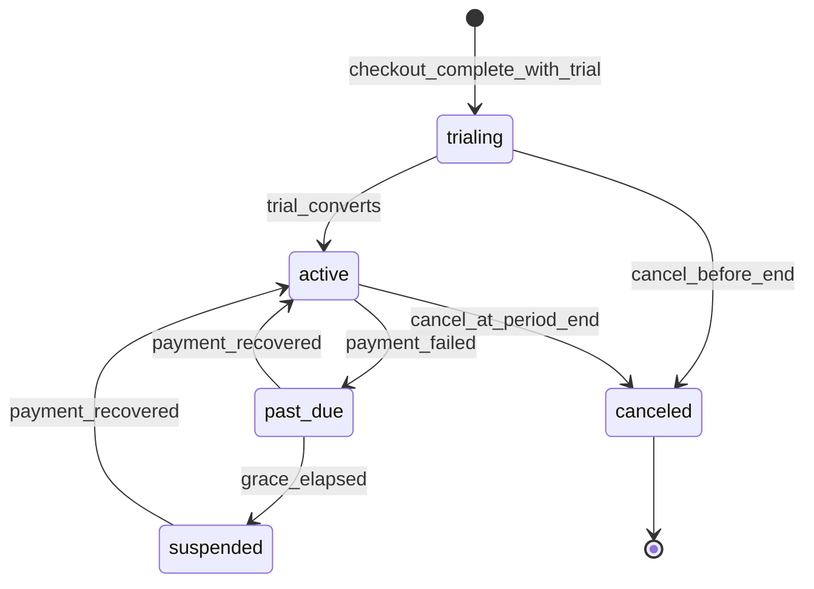

# Platform Subscription Billing and Entitlements Plan

**Status:** Architecture plan (docs-only). **Not** implementation authorization.
**Batch:** `dat-v1-commercial-platform-cutline-plan-v1`; plan display names aligned in `dat-plan-naming-and-doc-hygiene-v1` (DEC-058)
**Decisions:** [DEC-046](../architecture/decision-log.md), [DEC-047](../architecture/decision-log.md), [DEC-048](../architecture/decision-log.md)–[DEC-052](../architecture/decision-log.md), [DEC-058](../architecture/decision-log.md)

---

## Purpose

Define how **Platform** owns tenant subscription billing and how **DAT** consumes **effective entitlements** — without conflating Platform billing with the optional **school-facing ledger**.

---

## Ownership split

| Domain | Owner | Authoritative for |
| ------ | ----- | ----------------- |
| **Tenant subscription billing** | **Platform** | Customers, products, plans, prices, monthly/annual intervals, subscriptions, subscription items, add-ons, checkout sessions, provider customer/subscription IDs, invoice/payment status refs, trials, grace, cancel, suspend |
| **Effective entitlements** | **Platform** (compute + persist grants) | What modules a tenant may use after subscription + overrides |
| **License self-service UI** | **DAT** | Display plan, compare tiers, start checkout, upgrade/downgrade/cancel UI, link to provider billing portal |
| **School-facing ledger** | **DAT** | Student balances, packages, receipts — **separate** payment domain |
| **Lesson reminder orchestration** | **DAT** | Scheduling and send logic; entitlement-gated |

---

## Critical rule: License initiates; Platform authorizes

**DEC-047:** DAT `/admin/license` may **display** subscription state and **initiate** checkout or plan changes. DAT must **not** authorize paid entitlements from a **browser redirect** or client-side callback alone.

**Authoritative path:**

1. School Admin starts checkout or plan change from DAT License UI.
2. Platform creates checkout session / subscription change with provider.
3. Provider confirms payment (webhook or polling — provider TBD).
4. Platform persists billing event → projects entitlements.
5. DAT reads effective entitlements (existing resolver + extended module keys).

---

## Current implementation assessment (code, 2026-07-14)

**Partial foundation exists — not production-ready commercial billing.**

| Component | Path | State |
| --------- | ---- | ----- |
| Billing event store | `lib/billing/event-store.ts` | Implemented — idempotent `BillingEvent` |
| Payload projection V1 | `lib/billing/payload-v1.ts`, `processor.ts` | Implemented — updates `Organization.subscription*` + `EntitlementGrant` |
| Webhook route | `app/api/billing/webhooks/[provider]/route.ts` | Implemented — **no real signature verification** |
| Providers | `lib/billing/providers/*` | **Stub** — `createCheckout` returns invalid URLs |
| Plan map | `lib/billing/billing-plans.ts` | Static BASE/PREMIUM/ENTERPRISE — **not** DAT Core / DAT Plus / DAT Premium catalog |
| Platform onboard | `lib/platform/onboard-organization.ts` | Creates org + `LicenseKey`; **does not** auto-grant entitlements |
| DAT License UI | `app/admin/license/page.tsx` | **Read-only** for School Admin |
| Entitlement resolver | `lib/licensing/effective-entitlements.ts` | Implemented — manual `OrganizationFeature` + time-bound grants |
| Legacy `Payment` model | `prisma/schema.prisma` | **Not** subscription billing — school legacy, no `organizationId` |

**Do not claim** Platform or billing stack is production-ready because partial runtime exists.

---

## Target architecture (phased)

### Phase A — Commercial catalog (Platform)

- Product: `DAT`
- Plans: DAT Core, DAT Plus, DAT Premium (display names; planned keys `DAT_CORE`, `DAT_PLUS`, `DAT_PREMIUM`)
- Prices: monthly + annual per plan (amounts TBD)
- Add-ons: catalog entries linkable to subscription items
- Mapping: plan/add-on → module entitlement keys (see [dat-plan-and-module-catalog.md](../product/dat-plan-and-module-catalog.md))

### Phase B — Checkout and subscription lifecycle (Platform + provider)

- Checkout session creation (Platform API)
- Webhook ingestion with **verified** signatures
- Subscription states: trialing, active, past_due, canceled, suspended
- Upgrade, scheduled downgrade, cancel at period end
- Provider billing portal link where supported

### Phase C — Entitlement projection (Platform → DAT DB)

- Extend or replace `billing-plans.ts` static map with Platform-driven catalog
- Project `EntitlementGrant` rows with source `BILLING` on confirmed events
- Support add-on items → additional grants
- Commercial overrides (operator) — audit trail

### Phase D — DAT License self-service (DAT UI)

- Replace read-only Plan page with: current plan, compare tiers, interval selector, checkout CTA, manage subscription link
- Poll or subscribe to entitlement refresh after checkout (mechanism TBD — webhook-driven cache invalidation preferred)
- Keep demo guards and tenant scope

---

## Subscription lifecycle (product concepts)

Durations, retry counts, and provider-specific behavior remain **open decisions**.

---

## Separation from school ledger

| | Platform subscription | School ledger |
| --- | ------- | ------------- |
| Payer | School → DAT provider | Student → School |
| Owner | Platform billing domain | DAT operational module |
| Prisma today | `BillingEvent`, org subscription fields | `Payment` (legacy — unsuitable) |
| Entitlement | N/A (always required for DAT access) | `SCHOOL_LEDGER` module gate |

**DEC-052:** These are **separate payment domains**. No shared checkout or invoice model without explicit design.

---

## Open technical decisions

| Topic | Status |
| ----- | ------ |
| Payment provider (SIBS vs Stripe vs other) | Open |
| Tax/VAT handling | Open |
| Proration on upgrade | Open |
| Trial length and conversion | Open |
| Webhook vs polling for DAT entitlement refresh | Open |
| Single DB vs Platform service boundary at v1 | Phased extraction — see [platform-multi-product-control-plane-plan.md](./platform-multi-product-control-plane-plan.md) |

---

## Smallest safe implementation slices (recommended order)

1. `platform-commercial-catalog-schema-plan-v1` — docs + schema proposal (D4 gate)
2. `platform-subscription-checkout-foundation-v1` — checkout session + webhook hardening (sensitive)
3. `platform-entitlement-projection-v1` — DAT Core / DAT Plus / DAT Premium → grants
4. `dat-license-self-service-ui-v1` — License page checkout UX (initiate only)
5. `import-export-business-packaging-v1` — enforce tier vs existing self-service UI

Each slice requires explicit `APPROVED TO IMPLEMENT` when touching auth/billing/schema.

---

## Related documents

| Document | Role |
| -------- | ---- |
| [dat-plan-and-module-catalog.md](../product/dat-plan-and-module-catalog.md) | Plan/module definitions |
| [dat-vs-platform-boundary.md](../product/dat-vs-platform-boundary.md) | Boundary summary |
| [platform-multi-product-control-plane-plan.md](./platform-multi-product-control-plane-plan.md) | Control plane extraction |
