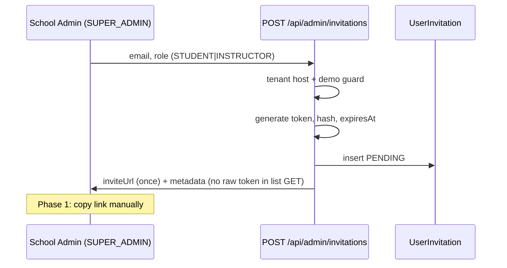

# Invite-only Foundation Plan

**Status:** Batches 1–5 **implemented** (full copy-link invite-only path for School Admin); **email provider + rate-limit/audit batches pending**.  
**Branch context:** `admin-invitation-ui`.  
**Related:** [signup-hardening-plan.md](./signup-hardening-plan.md), [engineering-excellence-audit.md](./engineering-excellence-audit.md) (EEA-007), [dat-production-readiness-gaps.md](../ops/dat-production-readiness-gaps.md), [release-checklist.md](../ops/release-checklist.md).

### Implementation status

| Layer                                                            | Status                                                                                                                                                                                                                                        |
| ---------------------------------------------------------------- | --------------------------------------------------------------------------------------------------------------------------------------------------------------------------------------------------------------------------------------------- |
| **`UserInvitation` + `UserInvitationStatus`**                    | **Implemented** — [`prisma/schema.prisma`](../../prisma/schema.prisma); migration [`20260521120000_add_user_invitations`](../../prisma/migrations/20260521120000_add_user_invitations/migration.sql).                                         |
| **Token service** (`generate` / `hash` / expiry / accept policy) | **Implemented** — [`lib/invitations/invitation-token-service.ts`](../../lib/invitations/invitation-token-service.ts). Raw token exists only at creation/link build time; **DB stores `tokenHash` only**.                                      |
| **Admin invitation API**                                         | **Implemented** — `GET/POST /api/admin/invitations`, `POST /api/admin/invitations/[id]/revoke`; [`lib/invitations/invitation-service.ts`](../../lib/invitations/invitation-service.ts). **`inviteLink` only on create** (phase 1 copy/paste). |
| **Public accept API + minimal page**                             | **Implemented** — `GET/POST /api/invitations/accept`, [`app/invitations/accept/page.tsx`](../../app/invitations/accept/page.tsx); [`lib/invitations/invitation-accept-service.ts`](../../lib/invitations/invitation-accept-service.ts).       |
| **Admin invitation UI**                                          | **Implemented** — [`components/admin/invitations-management-client.tsx`](../../components/admin/invitations-management-client.tsx) on Admin Users page: create, list, revoke, copy `inviteLink` once (no localStorage).                       |
| **Email provider**                                               | **Pending** — batch 6 below.                                                                                                                                                                                                                  |
| **End-user invite acceptance**                                   | **Available** via API + minimal page; signup unchanged; instructor placeholder license until admin updates profile.                                                                                                                           |
| **Pending duplicate per org/email**                              | **Enforced in service** (`pending_invitation_exists`); DB partial unique still optional follow-up.                                                                                                                                            |

---

## Scope

This document defines the **technical foundation for organization-scoped user invitations** on DAT (Driving Academy Tool). The goal is to replace or strictly limit **broad public self-serve signup** with a **B2B invite flow** where each driving school provisions students and instructors through its School Admin.

**Batch 1** added the Prisma model and migration only. Later batches add services, APIs, and UI. **Signup, billing, demo, lessons, and vehicles are unchanged** in batch 1.

**In scope (future batches):** invitation records, secure tokens, admin APIs, accept flow, optional manual invite links, audit hooks, and tests.

**Out of scope (all batches here and cross-linked plans):** billing, demo sandbox policy, lessons/vehicles/user-management refactors beyond invitation surfaces, i18n expansion, platform org onboarding redesign, full NextAuth rewrite, and reopening anonymous public signup without an explicit product decision.

---

## Current state

### Public signup

| Item                | State                                                                                                                                                                                     |
| ------------------- | ----------------------------------------------------------------------------------------------------------------------------------------------------------------------------------------- |
| **Default posture** | Public signup **disabled** for non-demo orgs unless `PUBLIC_SIGNUP_ENABLED=true` (trimmed, case-insensitive). Policy: [`lib/signup/signup-policy.ts`](../../lib/signup/signup-policy.ts). |
| **API**             | `POST /api/signup` — [`app/api/signup/route.ts`](../../app/api/signup/route.ts) returns **403** `public_signup_disabled` when off.                                                        |
| **Demo orgs**       | Always **403** `demo_signup_disabled` when `Organization.isDemo = true`, regardless of env flag.                                                                                          |
| **Register UI**     | [`app/auth/register/page.tsx`](../../app/auth/register/page.tsx) still reachable; shows policy error codes from API.                                                                      |
| **Roles on signup** | `STUDENT`, `INSTRUCTOR` only; `SUPER_ADMIN` rejected. No `PLATFORM_ADMIN`.                                                                                                                |

### School Admin provisioning (today)

| Item                  | State                                                                                                                                                                                                                          |
| --------------------- | ------------------------------------------------------------------------------------------------------------------------------------------------------------------------------------------------------------------------------ |
| **Primary B2B path**  | School Admin (`SUPER_ADMIN` session) creates users via **`POST /api/users/create`** — [`app/api/users/create/route.ts`](../../app/api/users/create/route.ts).                                                                  |
| **List users**        | `GET /api/admin/users` — role-filtered list for scheduling and admin UI ([`app/admin/users/page.tsx`](../../app/admin/users/page.tsx)).                                                                                        |
| **Tenant guards**     | [`lib/users/user-route-access.ts`](../../lib/users/user-route-access.ts) — tenant host, demo mutation guard, **`PLATFORM_ADMIN` blocked** on tenant user APIs. Assignable roles today: `STUDENT`, `INSTRUCTOR`, `SUPER_ADMIN`. |
| **Password handling** | Admin create may set or generate password (production must not return secrets in JSON — see ops gaps).                                                                                                                         |

### Email and verification

| Item                   | State                                                                                                                                                                                   |
| ---------------------- | --------------------------------------------------------------------------------------------------------------------------------------------------------------------------------------- |
| **Email provider**     | **None** integrated (no Resend/SendGrid/SES).                                                                                                                                           |
| **Email verification** | **Not implemented** — signup still sets `isEmailVerified: true` as a placeholder; `User.emailVerificationToken` / `emailVerificationExpiresAt` exist on schema but are unused in flows. |
| **NextAuth**           | Credentials provider — [`app/api/auth/[...nextauth]/route.ts`](../../app/api/auth/[...nextauth]/route.ts); login does not gate on real verification today.                              |

### Platform and demo (out of invite flow)

| Item               | State                                                                                                                                                                     |
| ------------------ | ------------------------------------------------------------------------------------------------------------------------------------------------------------------------- |
| **Platform Admin** | Created via platform operator paths (`/api/platform/organizations`, scripts) — **not** via tenant signup or School Admin user APIs.                                       |
| **Demo personas**  | Private personas via operator scripts (`pnpm demo:personas:configure`, etc.) — **outside** invite flow; demo org blocks public signup and demo user-management mutations. |

### Multi-tenant context

- Users belong to an **`organizationId`** (nullable only for legacy/platform edge cases; tenant app users are org-scoped).
- Tenant resolution uses **`OrganizationDomain`** host mapping ([`lib/tenant.ts`](../../lib/tenant.ts)).
- **`User.email` is globally unique** in the current schema — acceptance flow must handle “email already exists” without cross-tenant enumeration leaks.

---

## Product model

### Who invites whom

| Actor                                           | Action                                                                                                                      |
| ----------------------------------------------- | --------------------------------------------------------------------------------------------------------------------------- |
| **School Admin** (`SUPER_ADMIN` on tenant host) | Creates an invitation for a **Student** or **Instructor** at their organization.                                            |
| **Invitee**                                     | Opens a time-limited link, sets password (and required profile fields), and lands in the correct org with the invited role. |
| **Platform operator**                           | **Outside** this flow — no invitation to `PLATFORM_ADMIN`.                                                                  |

### Invitation properties (logical)

| Field            | Rule                                                                                                                                                                                                               |
| ---------------- | ------------------------------------------------------------------------------------------------------------------------------------------------------------------------------------------------------------------ |
| **Organization** | Every invitation belongs to exactly one `organizationId` (tenant).                                                                                                                                                 |
| **Target role**  | `STUDENT` or `INSTRUCTOR` only — **never** `PLATFORM_ADMIN`; **`SUPER_ADMIN` not inviteable** (school admins remain operator-provisioned via existing admin create or internal process).                           |
| **Target email** | Normalized (trim, lower-case) email the invite is sent to; must match on accept.                                                                                                                                   |
| **Expiration**   | `expiresAt` — default recommendation **7 days** (configurable per batch; document in env).                                                                                                                         |
| **Status**       | `PENDING` → `ACCEPTED` \| `EXPIRED` \| `REVOKED`.                                                                                                                                                                  |
| **Token**        | High-entropy secret shown **once** to admin (phase 1: copy link) or email (phase 2); **only hash stored** in DB.                                                                                                   |
| **Acceptance**   | Creates a new `User` in the org **or** links an existing user **only** if product policy allows same-email reuse (default: **new user** for invited email; existing global email → generic error, no enumeration). |
| **Approval**     | Align with signup: students `isApproved: true`; instructors `isApproved: false` until School Admin approves (same as [`POST /api/signup`](../../app/api/signup/route.ts)).                                         |
| **Profiles**     | On accept, create `Student` or `Instructor` rows and related fields (categories, license for instructor) mirroring signup/admin-create validation.                                                                 |

### Relationship to public signup

- **Production default:** keep `PUBLIC_SIGNUP_ENABLED` unset/false; onboarding is **invite + admin create**.
- Invitations are the **recommended** self-serve path for invitees; public `/auth/register` may later redirect to “use your invite link” or stay disabled at API level.
- **Do not** use invitations to bootstrap platform-level accounts.

---

## Data model

**Implemented in Prisma** ([`prisma/schema.prisma`](../../prisma/schema.prisma)):

```prisma
enum UserInvitationStatus {
  PENDING
  ACCEPTED
  EXPIRED
  REVOKED
}

model UserInvitation {
  id              String               @id @default(cuid())
  organizationId  String
  email           String
  role            UserRole             // application allowlist: STUDENT | INSTRUCTOR only (service layer)
  tokenHash       String               @unique
  status          UserInvitationStatus @default(PENDING)
  expiresAt       DateTime
  acceptedAt      DateTime?
  revokedAt       DateTime?
  createdByUserId String?
  acceptedUserId  String?
  createdAt       DateTime             @default(now())
  updatedAt       DateTime             @updatedAt

  organization Organization @relation(...)
  createdBy    User?        @relation("UserInvitationCreatedBy", ...)
  acceptedUser User?        @relation("UserInvitationAcceptedUser", ...)

  @@index([organizationId])
  @@index([organizationId, email])
  @@index([organizationId, status])
  @@index([expiresAt])
  @@index([createdByUserId])
  @@index([acceptedUserId])
  @@map("user_invitations")
}
```

### Design notes

| Topic                  | Decision                                                                                                                                                                                                          |
| ---------------------- | ----------------------------------------------------------------------------------------------------------------------------------------------------------------------------------------------------------------- |
| **Token storage**      | Store **`tokenHash`** only — SHA-256 hex via [`hashInvitationToken`](../../lib/invitations/invitation-token-service.ts) (implemented). **Never** persist raw token.                                               |
| **Raw token delivery** | Returned once on create (phase 1 UI copy) or embedded in email link (phase 2). Format: opaque string (≥ 32 bytes from `crypto.randomBytes`, base64url).                                                           |
| **Unique constraints** | `tokenHash` unique globally. **Pending per org/email** enforced in [`createInvitation`](../../lib/invitations/invitation-service.ts) (`pending_invitation_exists`); optional DB partial unique still a follow-up. |
| **Role constraint**    | Enforce in service layer: reject `PLATFORM_ADMIN`, `SUPER_ADMIN` at create API; DB check optional via app validation first.                                                                                       |
| **Expiry**             | Cron or lazy expiry on read: if `now > expiresAt` and `PENDING`, treat as `EXPIRED` (update status on access).                                                                                                    |
| **Cascade**            | `onDelete: Cascade` from organization — invitations die with org (consistent with tenant lifecycle).                                                                                                              |
| **Audit**              | Reuse existing [`AuditLog`](../../prisma/schema.prisma) for create/revoke/accept with `entityType: "UserInvitation"` (no schema change required for audit table).                                                 |

### Coexistence with `User`

- **`acceptedUserId`** set when invite completes.
- Optional future: `invitedAt` on `User` — **not required** for v1; invitation row is source of truth.
- Global unique `User.email` means accept must fail closed if email taken by another org — respond with **generic** message (see Security).

---

## Flows

### 1. School Admin creates invitation



### 2. System returns / sends invite link

- **Phase 1:** API returns `inviteUrl` in create response only; admin copies to email/Slack.
- **Phase 2:** Email provider sends templated link — built with [`buildInvitationAcceptUrl`](../../lib/invitations/invitation-token-service.ts) (`{baseUrl}/invitations/accept?token=...`). Accept page route ships in batch 4/5.

### 3. Invitee opens link

- Public **unauthenticated** page loads; client calls `GET /api/invitations/accept?token=...` to validate (without revealing org roster).
- Response: masked email hint, role, org display name, expiry state — **or** generic invalid/expired.

### 4. Invitee sets password / confirms profile

- `POST /api/invitations/accept` with token + password + required fields (name, instructor license if role instructor).
- Server verifies hash, status `PENDING`, not expired, tenant host matches invitation org.

### 5. User created or linked

- **Default v1:** `prisma.$transaction` — create `User` + `Student`/`Instructor` + optional `lessonCounter` for students (parity with signup).
- Set `passwordHash` (bcrypt cost 12, same as signup/admin create).
- Set `isEmailVerified` per verification policy (likely `false` until email verification batch; document coupling in batch 4).

### 6. Invitation marked accepted

- Update invitation: `status = ACCEPTED`, `acceptedAt`, `acceptedUserId`.
- Token cannot be reused (one-time).

---

## Security rules

| Rule                          | Implementation guidance                                                                                                                                                                                                          |
| ----------------------------- | -------------------------------------------------------------------------------------------------------------------------------------------------------------------------------------------------------------------------------- |
| **High-entropy tokens**       | `crypto.randomBytes(32)` (or equivalent); URL-safe encoding.                                                                                                                                                                     |
| **Hash at rest**              | Compare `hash(providedToken)` to `tokenHash`; constant-time compare.                                                                                                                                                             |
| **Expiry**                    | Reject accept after `expiresAt`; transition to `EXPIRED`.                                                                                                                                                                        |
| **One-time use**              | Only `PENDING` may accept; atomic update to `ACCEPTED` (optimistic lock or `updateMany` where `status = PENDING`).                                                                                                               |
| **Tenant scoped**             | Create/list/revoke require `SUPER_ADMIN` session `organizationId` + `guardTenantAuthenticatedRoute`. Accept resolves org from invitation, then validates request host matches that org ([`lib/tenant.ts`](../../lib/tenant.ts)). |
| **Role allowlist**            | `STUDENT`, `INSTRUCTOR` only on create and accept.                                                                                                                                                                               |
| **No PLATFORM_ADMIN**         | Reject at API validation; never in invitation UI role picker.                                                                                                                                                                    |
| **No SUPER_ADMIN via invite** | School admins are not onboarded through public invite links.                                                                                                                                                                     |
| **Rate limiting**             | **Distributed** limiter on `POST /api/invitations/accept` (and optionally create) — not in-memory `lib/rate-limit.ts` alone on Vercel ([signup-hardening-plan.md](./signup-hardening-plan.md)).                                  |
| **No email enumeration**      | Same response for invalid token, wrong org host, expired, and already accepted; avoid “email already registered” vs “invalid invite” distinction on public endpoints.                                                            |
| **Demo org**                  | `rejectDemoUserManagementMutation` on create/revoke; accept blocked for demo orgs (or read-only demo policy).                                                                                                                    |
| **Audit trail**               | Log invitation created, revoked, accepted (actor, IP, `entityId`) via `AuditLog`.                                                                                                                                                |
| **Logging**                   | **Never** log raw tokens in production; structured logs may include `invitationId`, `organizationId`, outcome.                                                                                                                   |
| **HTTPS only**                | Invite links must use tenant HTTPS host; no token in Referer to third parties (POST accept in body, not query for mutation).                                                                                                     |

---

## API / UI proposal

### Future APIs (tenant-authenticated unless noted)

| Method | Path                                 | Purpose                                                                     |
| ------ | ------------------------------------ | --------------------------------------------------------------------------- |
| `POST` | `/api/admin/invitations`             | Create invitation; return one-time `inviteUrl` (+ id, expiresAt, role).     |
| `GET`  | `/api/admin/invitations`             | List org invitations (status, email, role, dates; **no** token/hash).       |
| `POST` | `/api/admin/invitations/[id]/revoke` | Set `REVOKED` if `PENDING`.                                                 |
| `GET`  | `/api/invitations/accept`            | Public: validate token (query or header); return safe preview payload.      |
| `POST` | `/api/invitations/accept`            | Public: complete registration; body includes token + credentials + profile. |

**Auth pattern:** Admin routes — `getServerSession` + `SUPER_ADMIN` (consistent with [`/api/users/create`](../../app/api/users/create/route.ts)) or migrate to `verifyAuth` in a dedicated consistency batch. Accept routes — no session; token + tenant host guard.

**Response shapes:** Prefer `lib/api-utils` `successResponse` / `errorResponse` for new routes; stable `code` fields (`invite_invalid`, `invite_expired`, `invite_revoked`, `rate_limit_exceeded`).

### Future UI

| Surface                                                            | Change                                                                                                         |
| ------------------------------------------------------------------ | -------------------------------------------------------------------------------------------------------------- |
| **Admin Users** ([`/admin/users`](../../app/admin/users/page.tsx)) | “Invite user” action (email + role); table of pending/accepted/expired invites; copy-link button (phase 1).    |
| **Accept page**                                                    | New route e.g. `/auth/accept-invite` — password + profile form; error states for expired/revoked.              |
| **Register page**                                                  | Optional copy: “Have an invite? Open your link” — **no** broad signup CTA when `PUBLIC_SIGNUP_ENABLED` is off. |

---

## Email provider strategy

| Phase                             | Behavior                                                                                                                                                                                                                                                   |
| --------------------------------- | ---------------------------------------------------------------------------------------------------------------------------------------------------------------------------------------------------------------------------------------------------------- |
| **Phase 1 (no provider)**         | Create API returns `inviteUrl`; School Admin copies link through existing channels (email, WhatsApp, in-person). Document in runbook.                                                                                                                      |
| **Phase 2 (provider integrated)** | Send HTML/text template with link; resend with strict rate limit; bounce handling out of scope until provider chosen.                                                                                                                                      |
| **Logging**                       | Do not log full invite URLs in production without explicit redaction policy.                                                                                                                                                                               |
| **Verification coupling**         | When [signup-hardening-plan.md](./signup-hardening-plan.md) email-verification batch ships, decide whether accept sets `isEmailVerified: true` (invite proves inbox access) or still requires separate verification — **document decision in batch 4 PR**. |

---

## Implementation batches

Each batch is a **separate PR** with `pnpm -C driving_school_platform/nextjs_space check` green. Order is mandatory unless noted.

---

### Batch 1: `invitation-schema-foundation` — **implemented**

|                         |                                                                                                                               |
| ----------------------- | ----------------------------------------------------------------------------------------------------------------------------- |
| **Objective**           | Add `UserInvitation` (+ enum) to Prisma; migration; generate client.                                                          |
| **Risks**               | Wrong indexes; missing partial unique for pending-per-email.                                                                  |
| **Tests**               | Migration applies on clean DB; Prisma client types compile.                                                                   |
| **Acceptance criteria** | Met — schema + `20260521120000_add_user_invitations` in repo; no runtime routes; `check` passes.                              |
| **Follow-up**           | Partial unique index for one `PENDING` invite per `(organizationId, email)` — optional SQL migration or app check in batch 3. |

---

### Batch 2: `invitation-token-service` — **implemented**

|                         |                                                                                                                                                |
| ----------------------- | ---------------------------------------------------------------------------------------------------------------------------------------------- |
| **Objective**           | `lib/invitations/invitation-token-service.ts` — generate token, SHA-256 hash, accept URL, expiry helpers, `canAcceptInvitation`.               |
| **Risks**               | Weak hash algorithm; token length too short.                                                                                                   |
| **Tests**               | [`invitation-token-service.unit.test.ts`](../../lib/invitations/invitation-token-service.unit.test.ts). Role allowlist remains in batch 3 API. |
| **Acceptance criteria** | Met — pure functions tested; no HTTP surface; no raw token in schema or persisted code paths.                                                  |

---

### Batch 3: `admin-invitation-api` — **implemented**

|                         |                                                                                                                                                                                            |
| ----------------------- | ------------------------------------------------------------------------------------------------------------------------------------------------------------------------------------------ |
| **Objective**           | `POST/GET` admin invitations + revoke; tenant + demo guards; service-layer pending dedupe.                                                                                                 |
| **Routes**              | [`app/api/admin/invitations/route.ts`](../../app/api/admin/invitations/route.ts), [`app/api/admin/invitations/[id]/revoke/route.ts`](../../app/api/admin/invitations/[id]/revoke/route.ts) |
| **Service**             | [`lib/invitations/invitation-service.ts`](../../lib/invitations/invitation-service.ts), [`invitation-dto.ts`](../../lib/invitations/invitation-dto.ts)                                     |
| **Risks**               | Duplicate pending invites; leaking token in list endpoint.                                                                                                                                 |
| **Tests**               | [`invitation-service.unit.test.ts`](../../lib/invitations/invitation-service.unit.test.ts), route integration tests under `app/api/admin/invitations/`.                                    |
| **Acceptance criteria** | Met — SUPER_ADMIN tenant admin only; STUDENT/INSTRUCTOR invites; `inviteLink` on create only; no `tokenHash` in responses; demo block on POST/revoke; audit log deferred.                  |
| **Follow-up**           | Audit log on create/revoke (optional batch 7); accept endpoint (batch 4).                                                                                                                  |

---

### Batch 4: `invitation-accept-flow` — **implemented**

|                         |                                                                                                                                                                                                               |
| ----------------------- | ------------------------------------------------------------------------------------------------------------------------------------------------------------------------------------------------------------- |
| **Objective**           | Public GET/POST accept; user + profile transaction; mark `ACCEPTED`.                                                                                                                                          |
| **Routes**              | [`app/api/invitations/accept/route.ts`](../../app/api/invitations/accept/route.ts)                                                                                                                            |
| **Page**                | [`app/invitations/accept/page.tsx`](../../app/invitations/accept/page.tsx) (minimal; no i18n)                                                                                                                 |
| **Service**             | [`lib/invitations/invitation-accept-service.ts`](../../lib/invitations/invitation-accept-service.ts)                                                                                                          |
| **Risks**               | Race on double accept mitigated via `updateMany` on `PENDING`; `user_already_exists` if email taken.                                                                                                          |
| **Tests**               | [`invitation-accept-service.unit.test.ts`](../../lib/invitations/invitation-accept-service.unit.test.ts), [`route.integration.unit.test.ts`](../../app/api/invitations/accept/route.integration.unit.test.ts) |
| **Acceptance criteria** | Met — token-only public flow; org/role/email from invitation; no `tokenHash`/`passwordHash` in responses; bcrypt cost 12; `isEmailVerified: true` placeholder (real verification pending).                    |
| **Note**                | Instructor accept creates placeholder `instructorLicenseNumber` / expiry — School Admin should update via existing user management.                                                                           |

---

### Batch 5: `admin-invitation-ui` — **implemented**

|                         |                                                                                                                                                                                                      |
| ----------------------- | ---------------------------------------------------------------------------------------------------------------------------------------------------------------------------------------------------- |
| **Objective**           | Admin invite form + list + revoke + copy link on Users page.                                                                                                                                         |
| **UI**                  | [`invitations-management-client.tsx`](../../components/admin/invitations-management-client.tsx) — integrated in [`users-management-client.tsx`](../../components/admin/users-management-client.tsx). |
| **Risks**               | Invite link in page state only until refresh; mitigated with copy prompt.                                                                                                                            |
| **Tests**               | [`invitation-ui-utils.unit.test.ts`](../../lib/invitations/invitation-ui-utils.unit.test.ts); API covered by existing route tests.                                                                   |
| **Acceptance criteria** | Met — STUDENT/INSTRUCTOR only; `inviteLink` after create only; list has no `tokenHash`; revoke PENDING only.                                                                                         |
| **Follow-up**           | Email send (batch 6); optional Playwright E2E for admin invite flow.                                                                                                                                 |

---

### Batch 6: `email-provider-integration`

|                         |                                                                         |
| ----------------------- | ----------------------------------------------------------------------- |
| **Objective**           | Send invite email on create; env-based provider; templates.             |
| **Risks**               | Provider outage; PII in provider logs.                                  |
| **Tests**               | Mock provider in integration tests; staging send to test inbox.         |
| **Acceptance criteria** | Optional flag to send email; manual copy still works when provider off. |

---

### Batch 7: `invitation-rate-limit-audit`

|                         |                                                                                               |
| ----------------------- | --------------------------------------------------------------------------------------------- |
| **Objective**           | Distributed rate limits on accept (and create); expand audit coverage; ops runbook.           |
| **Risks**               | Shared NAT false positives.                                                                   |
| **Tests**               | Mock store exceeds threshold → 429.                                                           |
| **Acceptance criteria** | Limits survive serverless multi-instance staging test; runbook linked from release checklist. |

---

## Non-goals

- **Billing** — checkout, PSP webhooks, portal
- **Platform org onboarding** — `/api/platform/organizations` flows unchanged
- **Full auth rewrite** — replacing NextAuth or credentials model
- **Public signup reopening** — `PUBLIC_SIGNUP_ENABLED` policy unchanged by this plan alone
- **i18n** — new strings deferred unless product requests
- **Lessons / vehicles / existing user CRUD refactors** — except invitation-specific UI on Users page
- **Demo persona scripts** — remain operator-driven
- **Schema/code changes in this documentation batch**

---

## Operational checklist (before relying on invites in production)

1. `PUBLIC_SIGNUP_ENABLED` remains off unless self-serve is explicitly approved.
2. School Admins trained on **copy-link** (phase 1) or email send (phase 2).
3. Invite expiry and revoke documented in [release-checklist.md](../ops/release-checklist.md).
4. Monitoring on accept 4xx/5xx and 429 rates.
5. Review generic error copy with product/legal (enumeration).
6. Confirm demo org cannot create invites if policy requires read-only demo.

---

## Related documents

- [signup-hardening-plan.md](./signup-hardening-plan.md) — public signup gates; defers invite detail to this plan
- [engineering-excellence-audit.md](./engineering-excellence-audit.md) — EEA-007
- [dat-production-readiness-gaps.md](../ops/dat-production-readiness-gaps.md) — P1 signup remaining work
- [release-checklist.md](../ops/release-checklist.md) — pre-release signup/invite decisions
- [public-demo-policy.md](../ops/public-demo-policy.md) — demo signup disabled
- [production-host-split.md](../ops/production-host-split.md) — tenant vs platform hosts
- [environment-variables.md](../ops/environment-variables.md) — future invite TTL / provider keys
